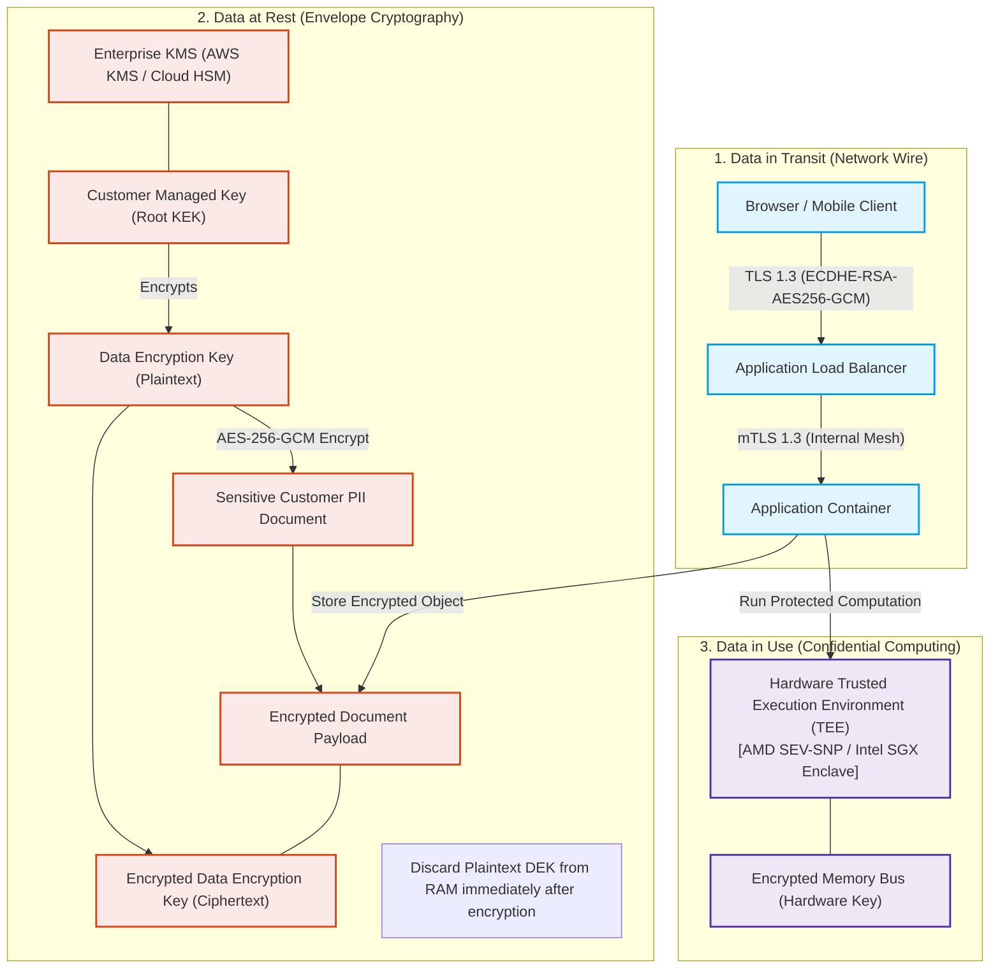

# Data Encryption Architecture: In-Transit, At-Rest & In-Use

Comprehensive cryptographic architectural patterns covering envelope encryption, transparent database encryption (TDE), TLS 1.3, and confidential computing.

## Mermaid Architecture Diagram



## PlantUML Specification

```plantuml
@startuml
package "In Transit" {
  [Client] --> [Ingress ALB] : TLS 1.3
  [Ingress ALB] --> [Service Pod] : mTLS
}
package "At Rest (Envelope Cryptography)" {
  [KMS Key (KEK)] --> [Data Key (DEK)] : Protects
  [Data Key (DEK)] --> [PII Payload] : AES-256-GCM
}
package "In Use" {
  [Secure Enclave (Intel SGX / AMD SEV)] : Memory Encryption
}
@enduml
```

## Architectural Design Considerations

* **Envelope Encryption**: Never encrypt mass payloads directly with root KMS keys; use KMS solely to generate and encrypt ephemeral Data Encryption Keys (DEKs).
* **Cryptographic Agility**: Support cipher suite upgrades and key migration paths without necessitating massive system refactoring.
* **Confidential Computing**: Implement hardware enclaves (AMD SEV / Intel SGX) when processing unencrypted data in multi-tenant untrusted clouds.

## Related Documentation & Patterns

* [Key Management](file:///d:/company/products/enterprise-architecture-handbook/17-diagrams/security/key-management.md)
* [Secrets Management](file:///d:/company/products/enterprise-architecture-handbook/17-diagrams/security/secrets-management.md)
* [Data Classification](file:///d:/company/products/enterprise-architecture-handbook/17-diagrams/security/data-classification.md)
