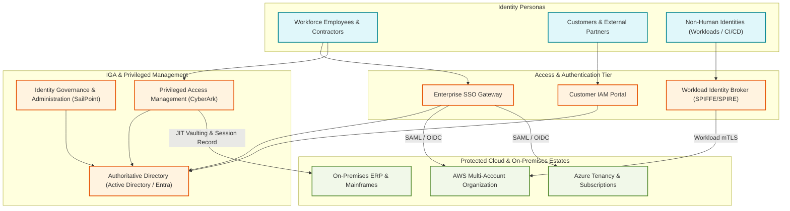
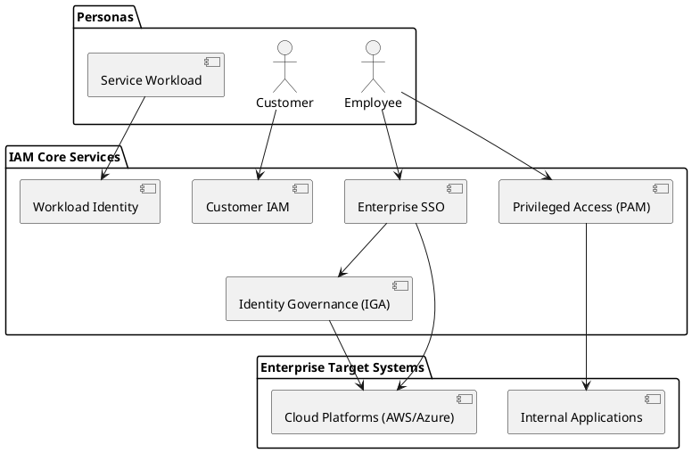

# Identity & Access Management (IAM) Reference Architecture

Comprehensive enterprise IAM ecosystem uniting workforce identity, customer IAM (CIAM), privileged access, and automated governance.

## Mermaid Architecture Diagram

## PlantUML Specification

## Architectural Design Considerations

* **Machine Identity Growth**: Non-human identities (service accounts, API keys, certs) outnumber humans 45:1; treat machine identity governance with equal priority.
* **Access Certification**: Schedule automated quarterly access recertification campaigns via IGA tools for regulatory frameworks (SOX, SOC 2, HIPAA).
* **Separation of Duties (SoD)**: Enforce strict architectural segregation preventing single users from both developing and approving production releases.

## Related Documentation & Patterns

* [Identity Flow](file:///d:/company/products/enterprise-architecture-handbook/17-diagrams/security/identity-flow.md)
* [Zero Trust](file:///d:/company/products/enterprise-architecture-handbook/17-diagrams/security/zero-trust.md)
* [Privileged Access](file:///d:/company/products/enterprise-architecture-handbook/17-diagrams/security/privileged-access.md)
