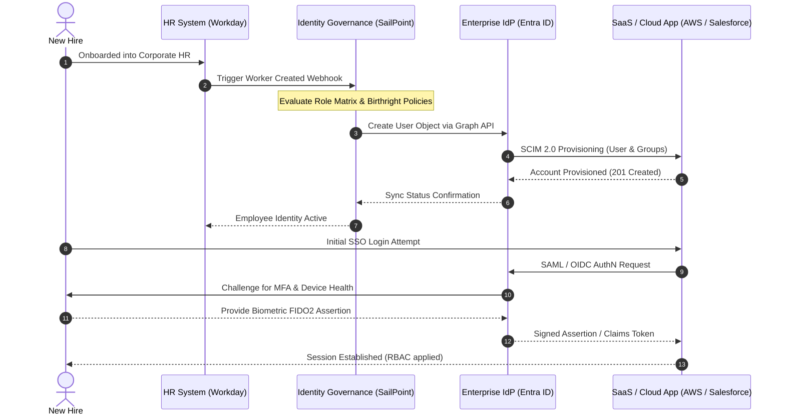
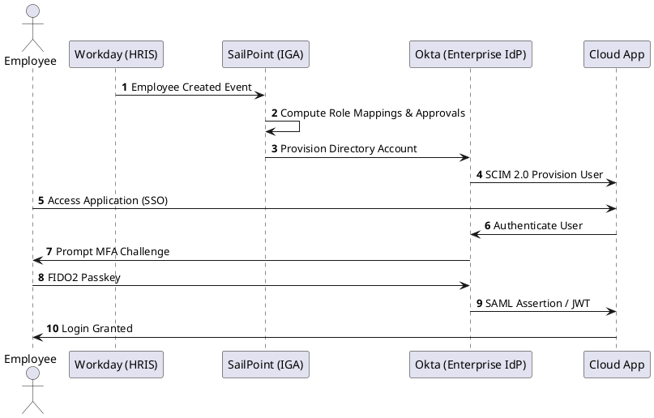

# Enterprise Identity Lifecycle & Federation Flow

End-to-end identity synchronization, automated SCIM provisioning, and cross-domain enterprise federation across disparate corporate directories.

## Mermaid Architecture Diagram

## PlantUML Specification

## Architectural Design Considerations

* **Authoritative Source of Truth**: HRIS (e.g., Workday) drives the identity lifecycle; no manual user creation in downstream applications.
* **Just-In-Time (JIT) vs SCIM**: Prefer automated SCIM 2.0 provisioning over JIT to ensure instant deprovisioning when an employee departs.
* **Auditability**: Every role mutation and account lifecycle event must emit structured audit events to SIEM.

## Related Documentation & Patterns

* [IAM Architecture](file:///d:/company/products/enterprise-architecture-handbook/17-diagrams/security/iam.md)
* [OAuth 2.0](file:///d:/company/products/enterprise-architecture-handbook/17-diagrams/security/oauth2.md)
* [Privileged Access Management](file:///d:/company/products/enterprise-architecture-handbook/17-diagrams/security/privileged-access.md)
