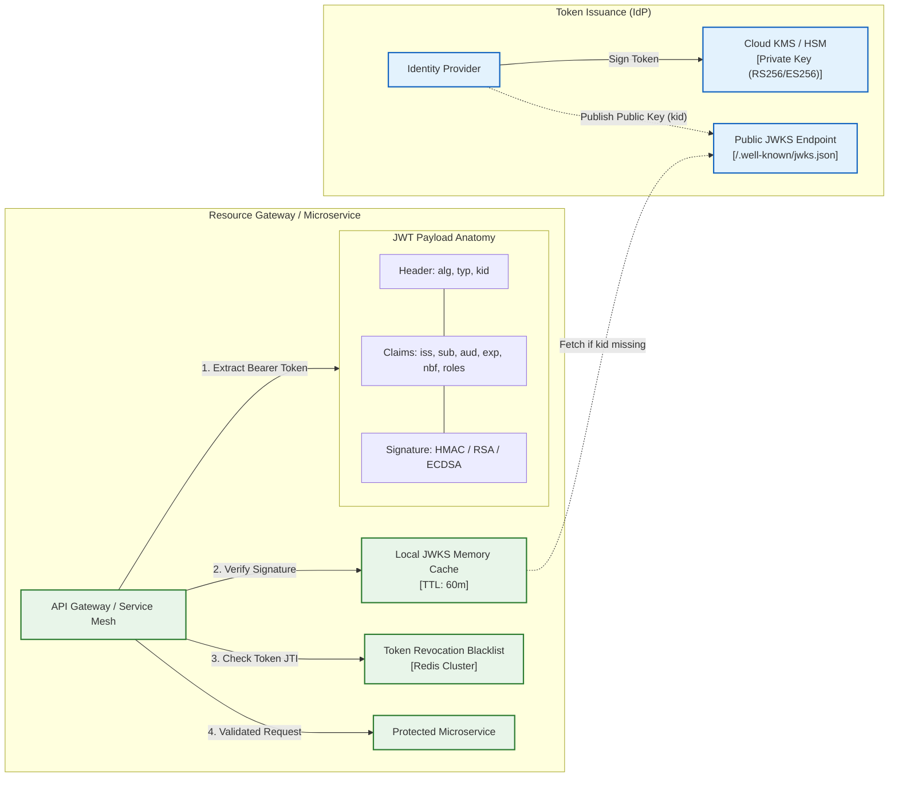
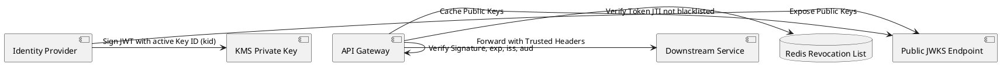

# JWT Architecture, Token Lifecycle & Cryptographic Rotation

Stateless token lifecycle architecture detailing asymmetric signing, JSON Web Key Sets (JWKS) cache/invalidation, claims validation, and blacklist strategies.

## Mermaid Architecture Diagram

## PlantUML Specification

## Architectural Design Considerations

* **Algorithm Whitelisting**: Explicitly reject `alg: "none"` and enforce strict asymmetric verification algorithms (`RS256` or `ES256`).
* **JWKS Key Rotation**: Validate tokens using the `kid` header parameter; allow seamless key rotation without downtime by maintaining previous and next public keys in JWKS.
* **Token Revocation Dilemma**: For stateless tokens requiring immediate revocation, check token `jti` against a distributed in-memory cache (Redis) or use ephemeral token lifetimes.

## Related Documentation & Patterns

* [OAuth 2.0](file:///d:/company/products/enterprise-architecture-handbook/17-diagrams/security/oauth2.md)
* [API Security](file:///d:/company/products/enterprise-architecture-handbook/17-diagrams/security/api-security.md)
* [Key Management](file:///d:/company/products/enterprise-architecture-handbook/17-diagrams/security/key-management.md)
