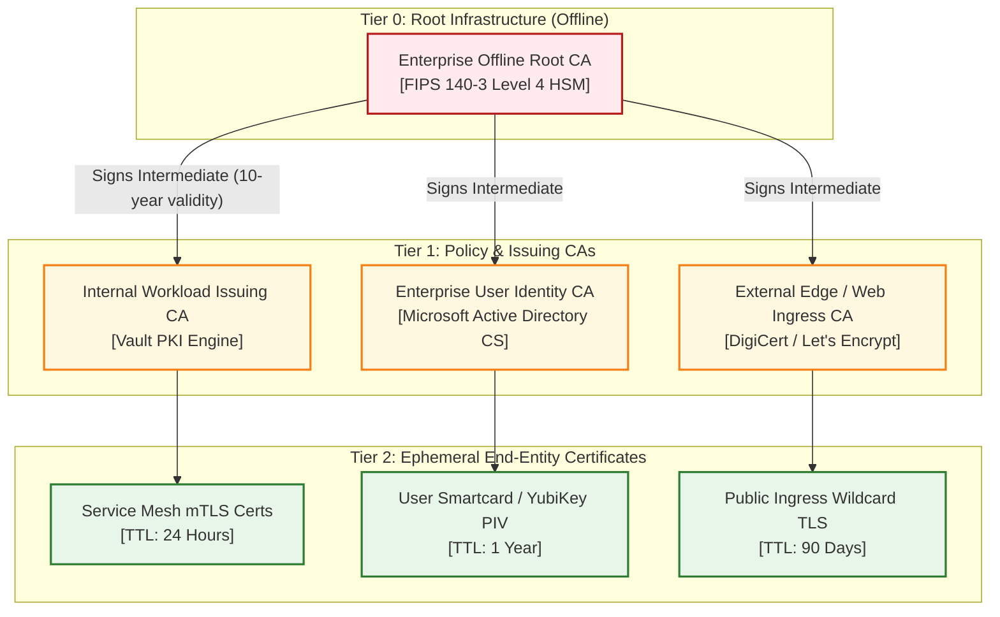
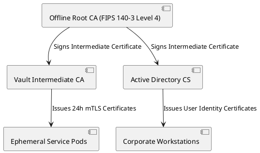

# Key Management Service (KMS) & Public Key Infrastructure (PKI)

Hierarchical Public Key Infrastructure (PKI) architecture and Hardware Security Module (HSM) root key lifecycle management.

## Mermaid Architecture Diagram

## PlantUML Specification

## Architectural Design Considerations

* **Offline Root CA**: Root CAs must remain physically or logically powered down, air-gapped from internal networks, and only activated for intermediate CA signing.
* **Automated Rotation**: Implement ACME protocol or Vault agent auto-renewal; eliminate manual certificate updates to eliminate outage risks.
* **Certificate Revocation**: Distribute lightweight Online Certificate Status Protocol (OCSP) stapling or short-lived certificates rather than large CRL files.

## Related Documentation & Patterns

* [Encryption](file:///d:/company/products/enterprise-architecture-handbook/17-diagrams/security/encryption.md)
* [Zero Trust](file:///d:/company/products/enterprise-architecture-handbook/17-diagrams/security/zero-trust.md)
* [Network Security](file:///d:/company/products/enterprise-architecture-handbook/17-diagrams/security/network-security.md)
