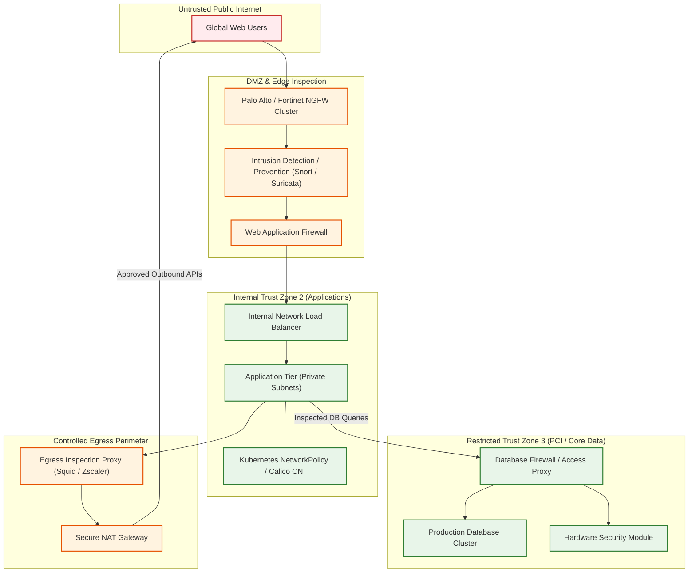
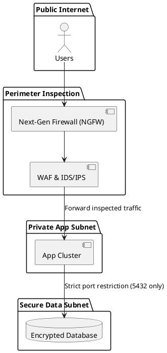

# Enterprise Network Security & Micro-Segmentation Architecture

Multi-tier network defense incorporating Next-Gen Firewalls (NGFW), IDS/IPS, egress traffic proxies, and VPC micro-segmentation.

## Mermaid Architecture Diagram

## PlantUML Specification

## Architectural Design Considerations

* **Default-Deny East-West Rules**: All container-to-container and VPC-to-VPC communication is blocked by default and requires explicit security group/NetworkPolicy white-listing.
* **Egress Traffic Inspection**: Block direct outbound internet access from private subnets; route all external calls through an egress filtering proxy to prevent data exfiltration.
* **Flow Log Analysis**: Stream VPC flow logs to SIEM for automated anomaly detection and lateral movement identification.

## Related Documentation & Patterns

* [Zero Trust](file:///d:/company/products/enterprise-architecture-handbook/17-diagrams/security/zero-trust.md)
* [WAF & DDoS](file:///d:/company/products/enterprise-architecture-handbook/17-diagrams/security/waf.md)
* [Trust Boundaries](file:///d:/company/products/enterprise-architecture-handbook/17-diagrams/security/trust-boundaries.md)
