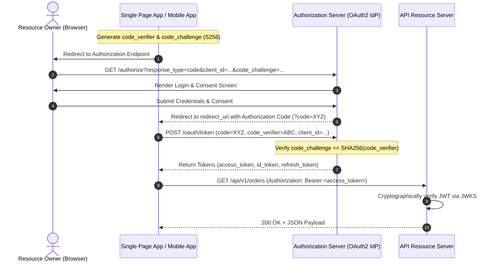
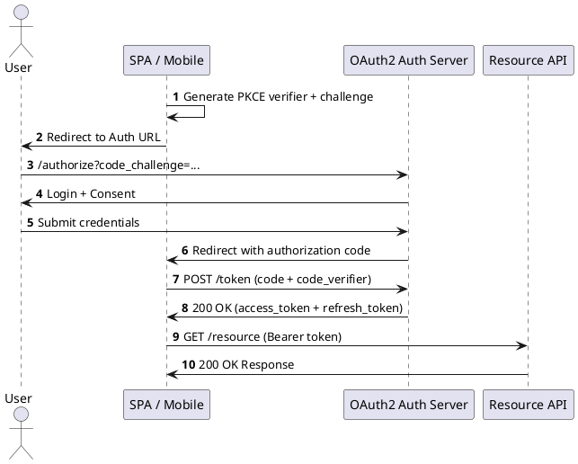

# OAuth 2.0 Authorization Framework & Grant Flows

Industry-standard token-based delegation architecture detailing Authorization Code Flow with PKCE (Proof Key for Code Exchange) and Client Credentials.

## Mermaid Architecture Diagram

## PlantUML Specification

## Architectural Design Considerations

* **Mandatory PKCE**: Use PKCE for all authorization code flows, including backend confidential clients and public SPAs, to prevent authorization code injection.
* **Deprecation of Implicit Flow**: Implicit grant (`response_type=token`) and Resource Owner Password Credentials (ROPC) are strictly prohibited.
* **Token Lifetime**: Access tokens should be short-lived (5-15 minutes); refresh tokens must support rotation and replay detection.

## Related Documentation & Patterns

* [OIDC](file:///d:/company/products/enterprise-architecture-handbook/17-diagrams/security/oidc.md)
* [JWT Architecture](file:///d:/company/products/enterprise-architecture-handbook/17-diagrams/security/jwt.md)
* [API Security](file:///d:/company/products/enterprise-architecture-handbook/17-diagrams/security/api-security.md)
