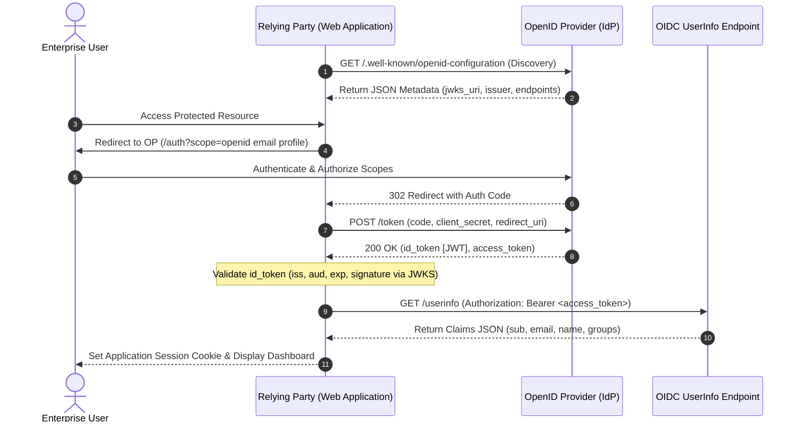
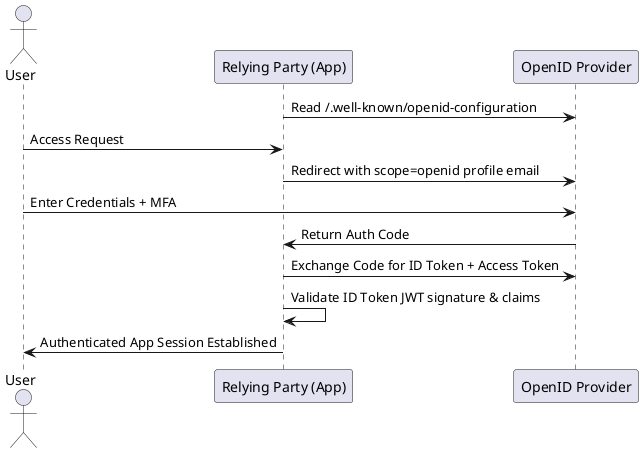

# OpenID Connect (OIDC) Federated Identity Architecture

Identity layer on top of OAuth 2.0 enabling clients to verify end-user identity based on authentication performed by an Authorization Server.

## Mermaid Architecture Diagram

## PlantUML Specification

## Architectural Design Considerations

* **Discovery Endpoint**: Relying parties must dynamically fetch OpenID metadata from `/.well-known/openid-configuration` rather than hardcoding endpoints.
* **Claims Validation**: The `iss` (issuer) must match the OP URL, `aud` (audience) must match the Client ID, and `nonce` must be verified against replay attacks.
* **Logout Specifications**: Implement OIDC Back-Channel Logout or RP-Initiated Logout for enterprise-wide single sign-out.

## Related Documentation & Patterns

* [OAuth 2.0](file:///d:/company/products/enterprise-architecture-handbook/17-diagrams/security/oauth2.md)
* [JWT Architecture](file:///d:/company/products/enterprise-architecture-handbook/17-diagrams/security/jwt.md)
* [Authentication](file:///d:/company/products/enterprise-architecture-handbook/17-diagrams/security/authentication.md)
