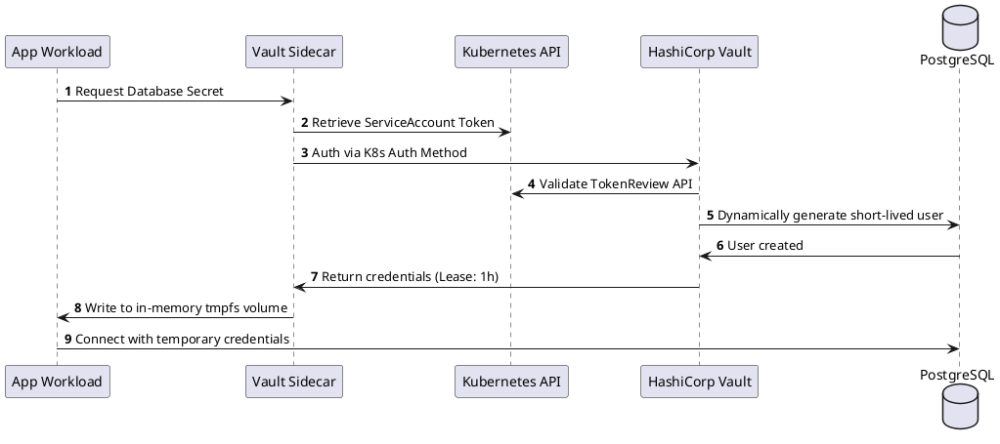

# Enterprise Secrets Management & Dynamic Credential Lifecycle

Dynamic ephemeral secrets leasing, automated rotation, and runtime injection via HashiCorp Vault and cloud-native KMS.

## Mermaid Architecture Diagram

```mermaid
sequenceDiagram
    autonumber
    participant Pod as Kubernetes Pod (Application)
    participant Agent as Vault Sidecar Agent / CSI Driver
    participant K8sAPI as Kubernetes API Server
    participant Vault as HashiCorp Vault Cluster
    participant TargetDB as Production PostgreSQL DB

    Pod->>Agent: Container Startup (Needs DB Password)
    Agent->>K8sAPI: Request Projected Service Account Token (JWT)
    K8sAPI-->>Agent: Issue K8s Workload JWT
    
    Agent->>Vault: POST /v1/auth/kubernetes/login (K8s JWT + Role)
    Vault->>K8sAPI: TokenReview (Verify JWT Signature & Namespace)
    K8sAPI-->>Vault: Status: Valid ServiceAccount
    Vault-->>Agent: Issue Ephemeral Vault Client Token
    
    Agent->>Vault: GET /v1/database/creds/billing-role
    Note over Vault: Vault dynamically connects to DB & creates user: v-token-app-123xyz
    Vault->>TargetDB: CREATE USER "v-token-app-123xyz" WITH PASSWORD '...' VALID UNTIL '+1h';
    TargetDB-->>Vault: User Created Successfully
    Vault-->>Agent: Return Dynamic Credentials (Lease: 3600s)
    
    Agent->>Pod: Mount Credentials into Shared Memory (/vault/secrets)
    Pod->>TargetDB: Connect using Dynamic User "v-token-app-123xyz"
    
    Note over Agent,Vault: Agent automatically renews lease; Revoked immediately upon pod termination
```

## PlantUML Specification



## Architectural Design Considerations

* **Zero Static Secrets**: Eliminate long-lived static passwords and connection strings; generate ephemeral, short-lived credentials on demand.
* **In-Memory Injection**: Mount secrets strictly into memory-backed filesystems (`tmpfs`) to prevent sensitive data from persisting to disk or swap space.
* **Automated Revocation**: Immediately revoke leases upon container shutdown or anomalous secret access events.

## Related Documentation & Patterns

* [Key Management](file:///d:/company/products/enterprise-architecture-handbook/17-diagrams/security/key-management.md)
* [Zero Trust](file:///d:/company/products/enterprise-architecture-handbook/17-diagrams/security/zero-trust.md)
* [Encryption](file:///d:/company/products/enterprise-architecture-handbook/17-diagrams/security/encryption.md)
