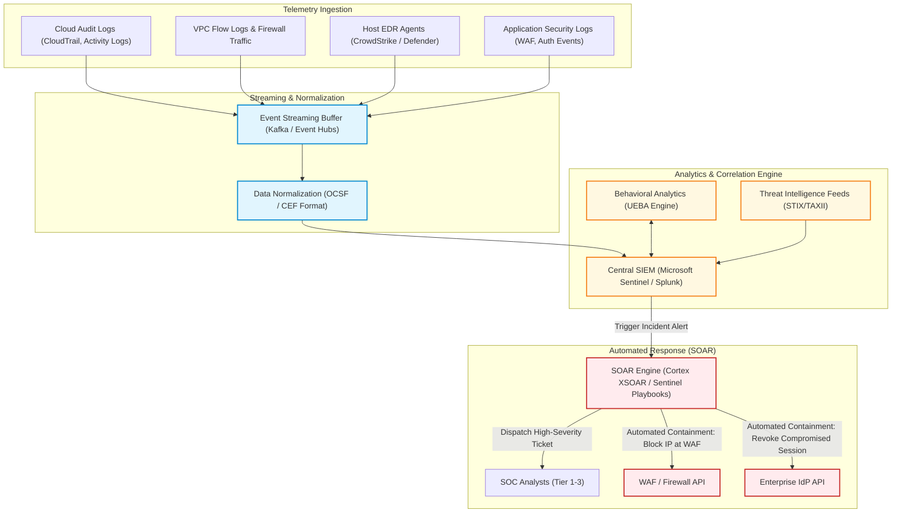
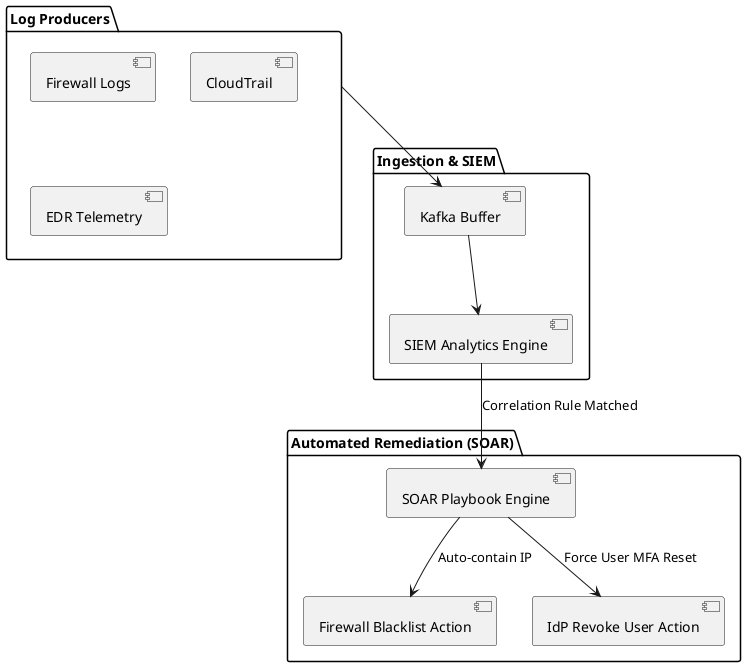

# Security Operations Center (SOC), SIEM & SOAR Architecture

End-to-end security telemetry pipeline uniting multi-cloud log ingest, automated event correlation, and SOAR automated playbook response.

## Mermaid Architecture Diagram

## PlantUML Specification

## Architectural Design Considerations

* **Standardized Schema**: Adopt Open Cybersecurity Schema Framework (OCSF) to harmonize events across multiple cloud providers and vendors.
* **Mean Time to Remediate (MTTR)**: Automate initial containment steps (quarantine host, block IP, revoke token) via SOAR playbooks to achieve sub-minute response times.
* **Log Immutability**: Write security audit trails directly to write-once-read-many (WORM) storage with strict legal hold policies.

## Related Documentation & Patterns

* [Threat Model](file:///d:/company/products/enterprise-architecture-handbook/17-diagrams/security/threat-model.md)
* [Zero Trust](file:///d:/company/products/enterprise-architecture-handbook/17-diagrams/security/zero-trust.md)
* [Network Security](file:///d:/company/products/enterprise-architecture-handbook/17-diagrams/security/network-security.md)
