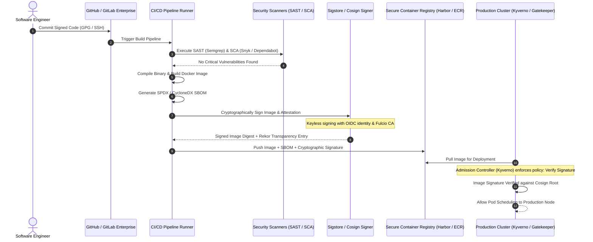
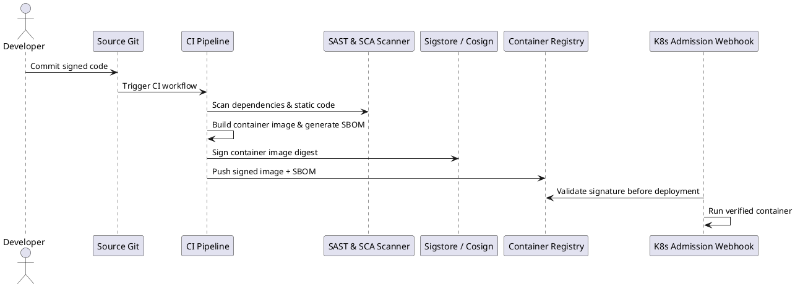

# Software Supply Chain Security & DevSecOps Architecture

End-to-end secure software factory implementing SAST, SCA, container image signing, Software Bill of Materials (SBOM), and SLSA Level 3 provenance.

## Mermaid Architecture Diagram

## PlantUML Specification

## Architectural Design Considerations

* **Shift-Left Security**: Enforce security gates during local development and pre-commit checks; prevent vulnerable code from entering mainline branches.
* **SLSA Framework Compliance**: Target SLSA (Supply-chain Levels for Software Artifacts) Level 3 by ensuring build platforms generate non-falsifiable provenance.
* **Admission Control Policy**: Enforce cluster-level admission controllers (e.g., Kyverno or OPA Gatekeeper) to reject un-signed container images.

## Related Documentation & Patterns

* [API Security](file:///d:/company/products/enterprise-architecture-handbook/17-diagrams/security/api-security.md)
* [Zero Trust](file:///d:/company/products/enterprise-architecture-handbook/17-diagrams/security/zero-trust.md)
* [Security Checklists](file:///d:/company/products/enterprise-architecture-handbook/17-diagrams/security/checklists.md)
