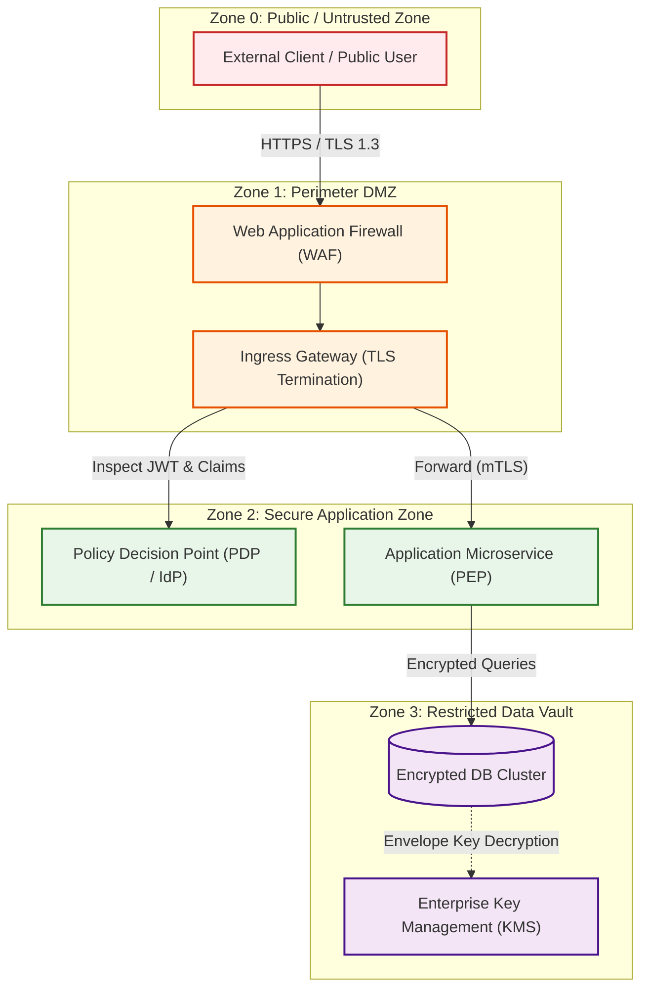
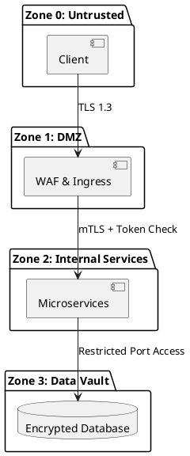

# Enterprise Security Architecture Diagram Template

Production-ready, copy-pasteable boilerplate template for authoring enterprise security architectures, trust boundaries, and credential flows.

## Mermaid Architecture Diagram

## PlantUML Specification

## Architectural Design Considerations

* **Copy and Adapt**: Use this template as the starting baseline for creating new architecture security diagrams across projects.
* **Consistent Color Palette**: Red (#ffebee) for untrusted zones, Orange (#fff3e0) for DMZ, Green (#e8f5e9) for application zones, and Purple (#f3e5f5) for restricted vaults.
* **Clarity of Boundaries**: Explicitly outline perimeter transitions using dashed subgraphs and numbered sequence flows.

## Related Documentation & Patterns

* [Zero Trust](file:///d:/company/products/enterprise-architecture-handbook/17-diagrams/security/zero-trust.md)
* [Trust Boundaries](file:///d:/company/products/enterprise-architecture-handbook/17-diagrams/security/trust-boundaries.md)
* [Security Checklists](file:///d:/company/products/enterprise-architecture-handbook/17-diagrams/security/checklists.md)
