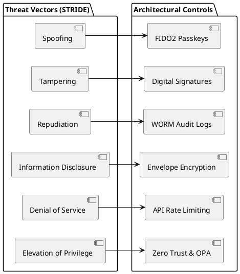

# Threat Modeling Architecture (STRIDE & Attack Surface)

Systematic threat modeling framework detailing STRIDE categories, trust boundary transitions, and risk mitigation mapping.

## Mermaid Architecture Diagram

```mermaid
graph TD
    subgraph STRIDECategories ["STRIDE Threat Categories"]
        S["Spoofing (Identity)"]
        T["Tampering (Data Integrity)"]
        R["Repudiation (Non-Repudiation)"]
        I["Information Disclosure (Confidentiality)"]
        D["Denial of Service (Availability)"]
        E["Elevation of Privilege (Authorization)"]
    end

    subgraph ThreatAnalysisFlow ["Threat Modeling Lifecycle"]
        Decomp["1. Deconstruct System (DFD & Components)"]
        Identify["2. Identify Threat Vectors (STRIDE per Element)"]
        Score["3. Risk Scoring (DREAD / CVSS)"]
        Mitigate["4. Implement Architecture Countermeasures"]
        Validate["5. Validate Residual Risk in ARB"]

        Decomp --> Identify
        Identify --> Score
        Score --> Mitigate
        Mitigate --> Validate
    end

    subgraph CountermeasureMapping ["Target Mitigations"]
        M1["MFA & FIDO2 (Mitigates Spoofing)"]
        M2["HMAC & Cryptographic Signing (Mitigates Tampering)"]
        M3["Immutable Audit Logs (Mitigates Repudiation)"]
        M4["TLS 1.3 & KMS Encryption (Mitigates Info Disclosure)"]
        M5["Rate Limiting & Autoscaling (Mitigates DoS)"]
        M6["Least Privilege RBAC & OPA (Mitigates Privilege Escalation)"]
    end

    S -.-> M1
    T -.-> M2
    R -.-> M3
    I -.-> M4
    D -.-> M5
    E -.-> M6
```

## PlantUML Specification

## Architectural Design Considerations

* **Early Lifecycle Integration**: Threat modeling must occur during system design before code is written, documented directly in Architecture Decision Records (ADRs).
* **Continuous Threat Modeling**: Update threat models whenever significant architectural changes occur (e.g., new external integration or cloud migration).
* **Attack Surface Minimization**: Disable unused services, ports, protocols, and APIs across all layers.

## Related Documentation & Patterns

* [Trust Boundaries](file:///d:/company/products/enterprise-architecture-handbook/17-diagrams/security/trust-boundaries.md)
* [Zero Trust](file:///d:/company/products/enterprise-architecture-handbook/17-diagrams/security/zero-trust.md)
* [Security Review Checklists](file:///d:/company/products/enterprise-architecture-handbook/17-diagrams/security/checklists.md)
