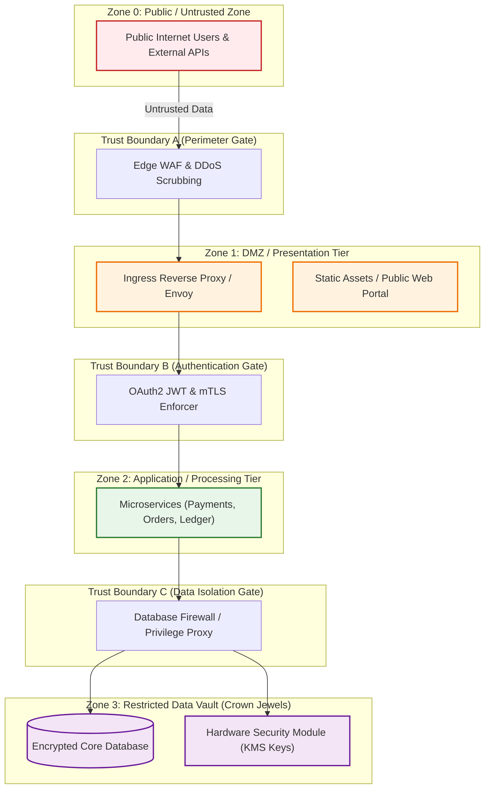
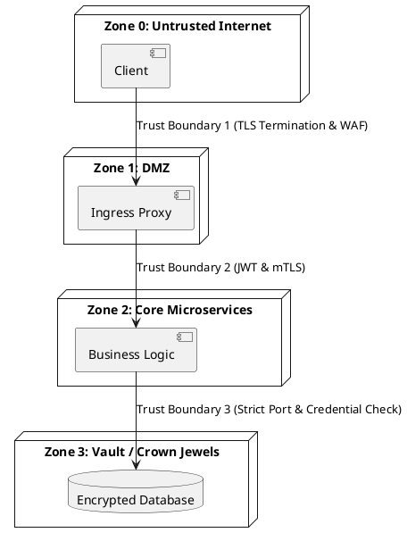

# Security Trust Boundaries & Zone Isolation Architecture

Multi-zone security segmentation detailing trust levels, data validation checkpoints, and sanitization gates crossing perimeter boundaries.

## Mermaid Architecture Diagram

## PlantUML Specification

## Architectural Design Considerations

* **Explicit Sanitization at Boundaries**: Never trust data originating from an adjacent lower-trust zone without schema validation and input sanitization.
* **No Transitive Trust**: Access to Zone 1 (DMZ) does not grant implicit access to Zone 3 (Data Vault); each boundary must enforce its own authentication and authorization.
* **Blast Radius Containment**: Isolate compromised containers within their respective trust zones using kernel-level sandboxing (gVisor / Firecracker).

## Related Documentation & Patterns

* [Zero Trust](file:///d:/company/products/enterprise-architecture-handbook/17-diagrams/security/zero-trust.md)
* [Threat Model](file:///d:/company/products/enterprise-architecture-handbook/17-diagrams/security/threat-model.md)
* [Network Security](file:///d:/company/products/enterprise-architecture-handbook/17-diagrams/security/network-security.md)
