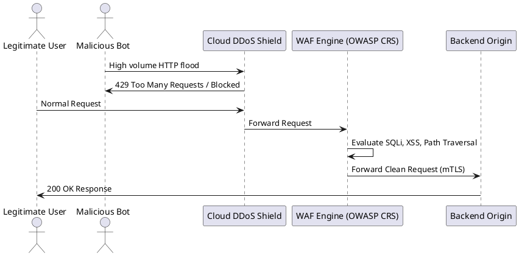

# Web Application Firewall (WAF) & DDoS Mitigation Pipeline

Layer 7 application defense architecture detailing edge DDoS scrubbing, OWASP Core Rule Set evaluation, and bot detection.

## Mermaid Architecture Diagram

```mermaid
graph LR
    subgraph ClientLayer ["Client Ingress"]
        Attacker["Bad Bot / DDoS Flooder"]
        GoodUser["Legitimate Browser"]
    end

    subgraph CloudEdgeWAF ["Cloud Edge WAF (Cloudflare / AWS WAF / Akamai)"]
        Scrubber["Anycast BGP DDoS Scrubbing Layer"]
        RateThrottler["IP & Token Bucket Rate Limiter"]
        BotEngine["Behavioral Bot Management (Fingerprint & CAPTCHA)"]
        OWASPRules["OWASP Top 10 Core Rule Set (SQLi, XSS, RCE)"]
        
        Attacker --> Scrubber
        GoodUser --> Scrubber
        Scrubber --> RateThrottler
        RateThrottler --> BotEngine
        BotEngine --> OWASPRules
    end

    subgraph OriginProtection ["Origin Infrastructure"]
        Shield["Origin Shield / Ingress ALB"]
        BackendApp["Target Web Application"]
        
        OWASPRules -->|"Sanitized Traffic (mTLS Origin Pull)"| Shield
        Shield --> BackendApp
    end

    classDef attack fill:#ffebee,stroke:#c62828,stroke-width:2px;
    classDef waf fill:#e0f2f1,stroke:#00695c,stroke-width:2px;
    class DefOrigin fill:#f3e5f5,stroke:#4a148c,stroke-width:2px;
    class Attacker attack;
    class Scrubber,RateThrottler,BotEngine,OWASPRules waf;
    class Shield,BackendApp DefOrigin;
```

## PlantUML Specification

## Architectural Design Considerations

* **Positive vs Negative Security Models**: Combine negative rules (blocking known threat signatures like SQLi) with positive rules (allowing only valid schemas and endpoints).
* **Origin Shielding**: Keep origin IP addresses private; configure firewalls to accept traffic solely from the CDN/WAF vendor's verified IP ranges.
* **WAF Tuning**: Run newly introduced WAF rules in 'Detection/Log' mode for a minimum of two weeks before switching to 'Block' mode to avoid false-positive disruptions.

## Related Documentation & Patterns

* [API Security](file:///d:/company/products/enterprise-architecture-handbook/17-diagrams/security/api-security.md)
* [Network Security](file:///d:/company/products/enterprise-architecture-handbook/17-diagrams/security/network-security.md)
* [Threat Model](file:///d:/company/products/enterprise-architecture-handbook/17-diagrams/security/threat-model.md)
