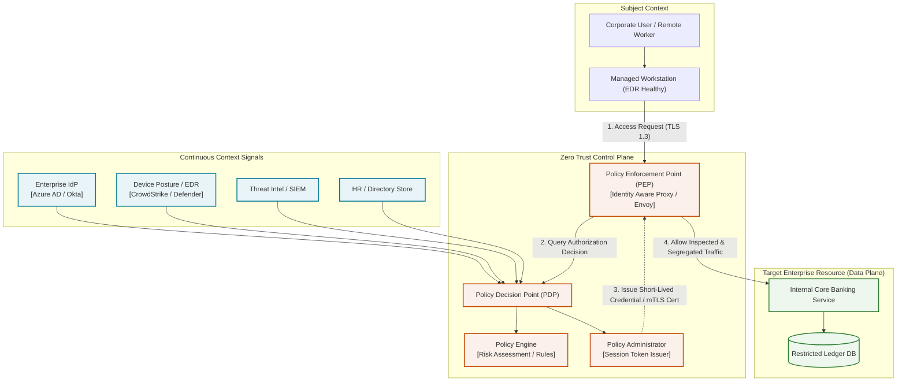
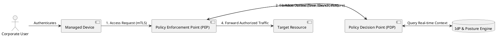

# Zero Trust Architecture (NIST SP 800-207)

Comprehensive Zero Trust Architecture establishing continuous dynamic verification, policy engine evaluation, and identity-aware micro-segmentation across untrusted networks.

## Mermaid Architecture Diagram

## PlantUML Specification

## Architectural Design Considerations

* **Never Trust, Always Verify**: Network locality provides zero implicit trust; every transaction is authenticated, authorized, and encrypted end-to-end.
* **Continuous Adaptive Evaluation**: Sessions are reassessed in real time if device compliance fails (e.g., EDR disabled or impossible travel detected).
* **Least Privilege Access**: Permissions are granted per session and per resource rather than broad subnet-level permissions.

## Related Documentation & Patterns

* [Identity Flow](file:///d:/company/products/enterprise-architecture-handbook/17-diagrams/security/identity-flow.md)
* [Trust Boundaries](file:///d:/company/products/enterprise-architecture-handbook/17-diagrams/security/trust-boundaries.md)
* [Network Security](file:///d:/company/products/enterprise-architecture-handbook/17-diagrams/security/network-security.md)
