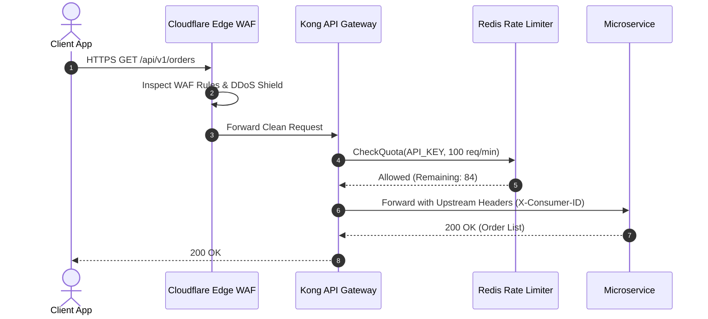

# API Gateway Request Routing Sequence

```mermaid
sequenceDiagram
    autonumber
    actor Client as Client App
    participant Edge as Cloudflare Edge WAF
    participant Kong as Kong API Gateway
    participant RateLimiter as Redis Rate Limiter
    participant Svc as Microservice

    Client->>Edge: HTTPS GET /api/v1/orders
    Edge->>Edge: Inspect WAF Rules & DDoS Shield
    Edge->>Kong: Forward Clean Request
    Kong->>RateLimiter: CheckQuota(API_KEY, 100 req/min)
    RateLimiter-->>Kong: Allowed (Remaining: 84)
    Kong->>Svc: Forward with Upstream Headers (X-Consumer-ID)
    Svc-->>Kong: 200 OK (Order List)
    Kong-->>Client: 200 OK
```
