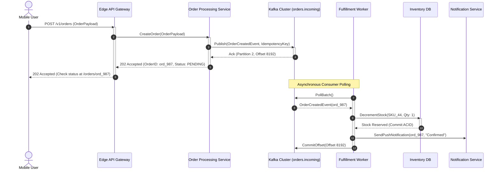

# Asynchronous Event-Driven Sequence Diagram

Asynchronous patterns decouple the producer from the consumer using message brokers, ensuring fast acknowledgment and non-blocking background processing.

