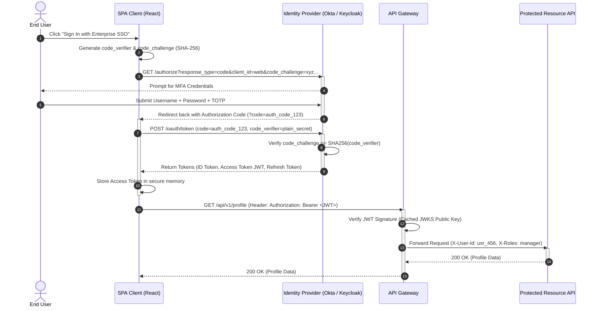

# Authentication & Authorization Sequence Diagram: OAuth2 Authorization Code with PKCE

The industry standard authentication pattern for Single-Page Applications (SPAs) and Native Mobile clients.

```mermaid
sequenceDiagram
    autonumber
    actor User as End User
    participant App as SPA Client (React)
    participant IdP as Identity Provider (Okta / Keycloak)
    participant Gateway as API Gateway
    participant API as Protected Resource API

    User->>App: Click "Sign In with Enterprise SSO"
    App->>App: Generate code_verifier & code_challenge (SHA-256)
    App->>IdP: GET /authorize?response_type=code&client_id=web&code_challenge=xyz...
    activate IdP
    IdP-->>User: Prompt for MFA Credentials
    User->>IdP: Submit Username + Password + TOTP
    IdP-->>App: Redirect back with Authorization Code (?code=auth_code_123)
    deactivate IdP

    activate App
    App->>IdP: POST /oauth/token (code=auth_code_123, code_verifier=plain_secret)
    activate IdP
    IdP->>IdP: Verify code_challenge == SHA256(code_verifier)
    IdP-->>App: Return Tokens (ID Token, Access Token JWT, Refresh Token)
    deactivate IdP
    App->>App: Store Access Token in secure memory
    deactivate App

    App->>Gateway: GET /api/v1/profile (Header: Authorization: Bearer <JWT>)
    activate Gateway
    Gateway->>Gateway: Verify JWT Signature (Cached JWKS Public Key)
    Gateway->>API: Forward Request (X-User-Id: usr_456, X-Roles: manager)
    activate API
    API-->>Gateway: 200 OK (Profile Data)
    deactivate API
    Gateway-->>App: 200 OK (Profile Data)
    deactivate Gateway
```
