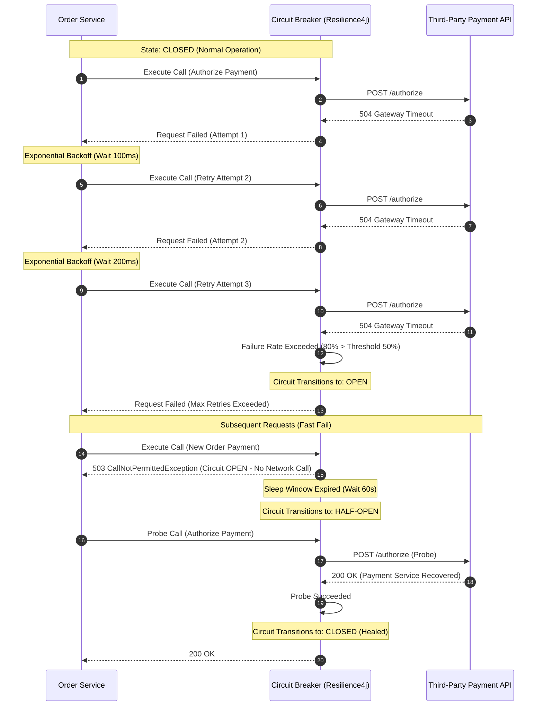

# Circuit Breaker & Retry Sequence Diagram

Illustrates client resilience using exponential backoff retry and transitioning to an **Open Circuit** state when downstream failures exceed thresholds.

