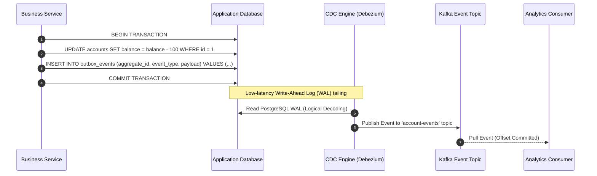

# Transactional Outbox Event Emission Sequence

```mermaid
sequenceDiagram
    autonumber
    participant App as Business Service
    participant DB as Application Database
    participant Debezium as CDC Engine (Debezium)
    participant Kafka as Kafka Event Topic
    participant Consumer as Analytics Consumer

    App->>DB: BEGIN TRANSACTION
    App->>DB: UPDATE accounts SET balance = balance - 100 WHERE id = 1
    App->>DB: INSERT INTO outbox_events (aggregate_id, event_type, payload) VALUES (...)
    App->>DB: COMMIT TRANSACTION
    
    Note over DB,Debezium: Low-latency Write-Ahead Log (WAL) tailing
    Debezium->>DB: Read PostgreSQL WAL (Logical Decoding)
    Debezium->>Kafka: Publish Event to 'account-events' topic
    Kafka-->>Consumer: Pull Event (Offset Committed)
```
