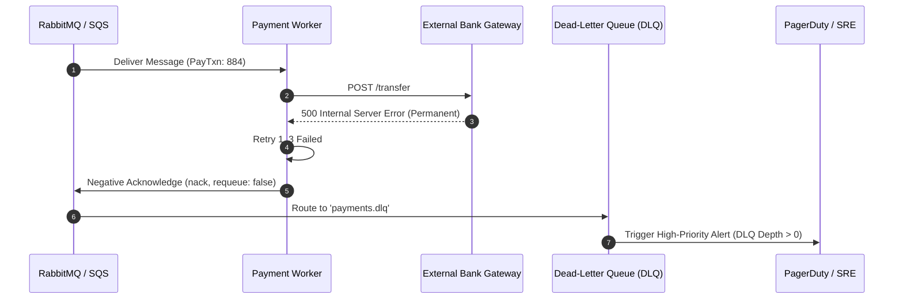

# Cascading Failure Containment & Dead-Letter Queue

```mermaid
sequenceDiagram
    autonumber
    participant Broker as RabbitMQ / SQS
    participant Consumer as Payment Worker
    participant ExtService as External Bank Gateway
    participant DLQ as Dead-Letter Queue (DLQ)
    participant Alert as PagerDuty / SRE

    Broker->>Consumer: Deliver Message (PayTxn: 884)
    Consumer->>ExtService: POST /transfer
    ExtService-->>Consumer: 500 Internal Server Error (Permanent)
    Consumer->>Consumer: Retry 1..3 Failed
    Consumer->>Broker: Negative Acknowledge (nack, requeue: false)
    Broker->>DLQ: Route to 'payments.dlq'
    DLQ->>Alert: Trigger High-Priority Alert (DLQ Depth > 0)
```
