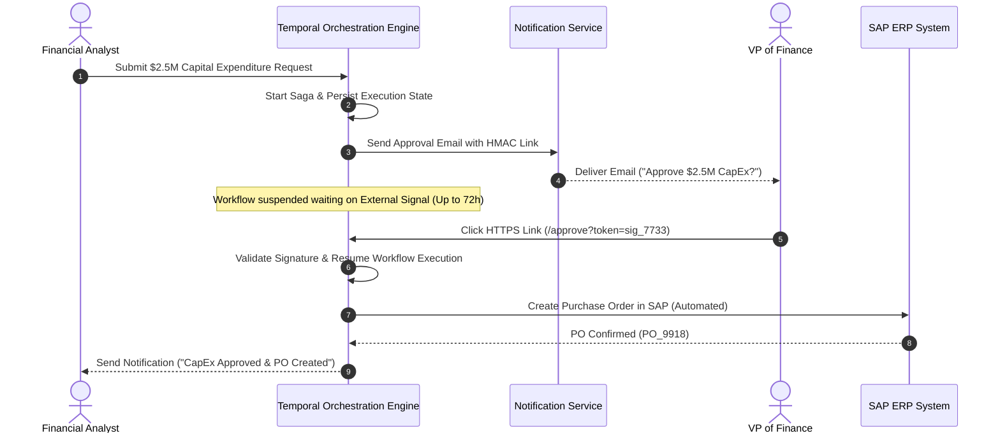

# Asynchronous Human-in-the-Loop Approval Workflow

```mermaid
sequenceDiagram
    autonumber
    actor Analyst as Financial Analyst
    participant Workflow as Temporal Orchestration Engine
    participant Email as Notification Service
    actor VP as VP of Finance
    participant ERP as SAP ERP System

    Analyst->>Workflow: Submit $2.5M Capital Expenditure Request
    Workflow->>Workflow: Start Saga & Persist Execution State
    Workflow->>Email: Send Approval Email with HMAC Link
    Email-->>VP: Deliver Email ("Approve $2.5M CapEx?")

    Note over Workflow: Workflow suspended waiting on External Signal (Up to 72h)
    VP->>Workflow: Click HTTPS Link (/approve?token=sig_7733)
    Workflow->>Workflow: Validate Signature & Resume Workflow Execution
    Workflow->>ERP: Create Purchase Order in SAP (Automated)
    ERP-->>Workflow: PO Confirmed (PO_9918)
    Workflow-->>Analyst: Send Notification ("CapEx Approved & PO Created")
```
