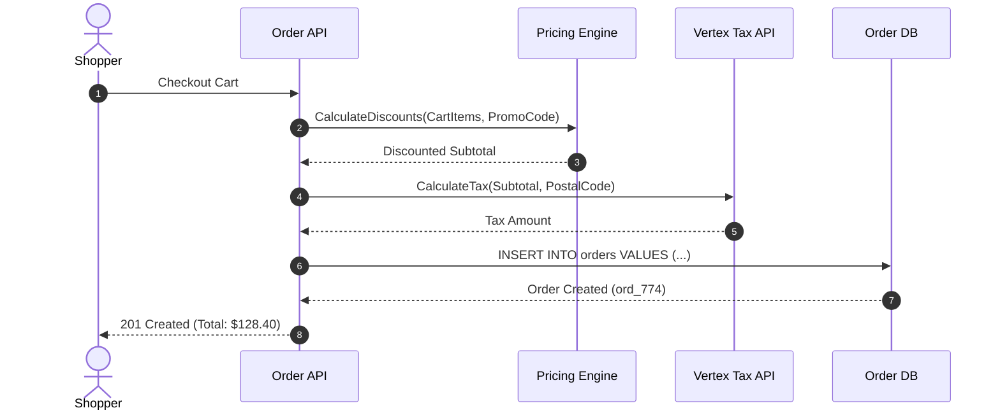

# Multi-Service Order Processing Sequence

```mermaid
sequenceDiagram
    autonumber
    actor User as Shopper
    participant Order as Order API
    participant Pricing as Pricing Engine
    participant Tax as Vertex Tax API
    participant DB as Order DB

    User->>Order: Checkout Cart
    Order->>Pricing: CalculateDiscounts(CartItems, PromoCode)
    Pricing-->>Order: Discounted Subtotal
    Order->>Tax: CalculateTax(Subtotal, PostalCode)
    Tax-->>Order: Tax Amount
    Order->>DB: INSERT INTO orders VALUES (...)
    DB-->>Order: Order Created (ord_774)
    Order-->>User: 201 Created (Total: $128.40)
```
