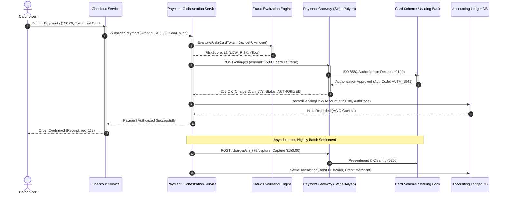

# Payment Processing Sequence Diagram: Two-Phase Authorization & Settlement

Illustrates card network integration with payment gateways, fraud detection, and ledger double-entry booking.

```mermaid
sequenceDiagram
    autonumber
    actor Customer as Cardholder
    participant Checkout as Checkout Service
    participant PaySvc as Payment Orchestration Service
    participant Fraud as Fraud Evaluation Engine
    participant Gateway as Payment Gateway (Stripe/Adyen)
    participant CardRail as Card Scheme / Issuing Bank
    participant Ledger as Accounting Ledger DB

    Customer->>Checkout: Submit Payment ($150.00, Tokenized Card)
    activate Checkout
    Checkout->>PaySvc: AuthorizePayment(OrderId, $150.00, CardToken)
    activate PaySvc

    PaySvc->>Fraud: EvaluateRisk(CardToken, DeviceIP, Amount)
    activate Fraud
    Fraud-->>PaySvc: RiskScore: 12 (LOW_RISK, Allow)
    deactivate Fraud

    PaySvc->>Gateway: POST /charges (amount: 15000, capture: false)
    activate Gateway
    Gateway->>CardRail: ISO 8583 Authorization Request (0100)
    activate CardRail
    CardRail-->>Gateway: Authorization Approved (AuthCode: AUTH_9941)
    deactivate CardRail
    Gateway-->>PaySvc: 200 OK (ChargeID: ch_772, Status: AUTHORIZED)
    deactivate Gateway

    PaySvc->>Ledger: RecordPendingHold(Account, $150.00, AuthCode)
    activate Ledger
    Ledger-->>PaySvc: Hold Recorded (ACID Commit)
    deactivate Ledger

    PaySvc-->>Checkout: Payment Authorized Successfully
    deactivate PaySvc
    Checkout-->>Customer: Order Confirmed (Receipt: rec_112)
    deactivate Checkout

    Note over PaySvc,CardRail: Asynchronous Nightly Batch Settlement
    PaySvc->>Gateway: POST /charges/ch_772/capture (Capture $150.00)
    Gateway->>CardRail: Presentment & Clearing (0200)
    PaySvc->>Ledger: SettleTransaction(Debit Customer, Credit Merchant)
```
