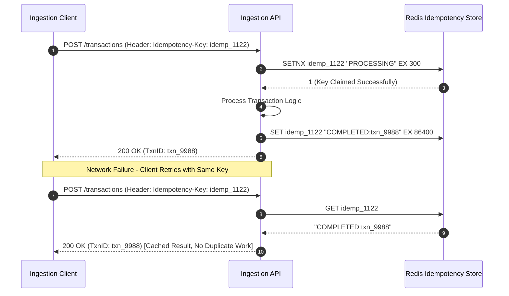

# Idempotent Retry Policy Sequence

```mermaid
sequenceDiagram
    autonumber
    participant Client as Ingestion Client
    participant API as Ingestion API
    participant Cache as Redis Idempotency Store

    Client->>API: POST /transactions (Header: Idempotency-Key: idemp_1122)
    API->>Cache: SETNX idemp_1122 "PROCESSING" EX 300
    Cache-->>API: 1 (Key Claimed Successfully)
    API->>API: Process Transaction Logic
    API->>Cache: SET idemp_1122 "COMPLETED:txn_9988" EX 86400
    API-->>Client: 200 OK (TxnID: txn_9988)

    Note over Client,API: Network Failure - Client Retries with Same Key
    Client->>API: POST /transactions (Header: Idempotency-Key: idemp_1122)
    API->>Cache: GET idemp_1122
    Cache-->>API: "COMPLETED:txn_9988"
    API-->>Client: 200 OK (TxnID: txn_9988) [Cached Result, No Duplicate Work]
```
