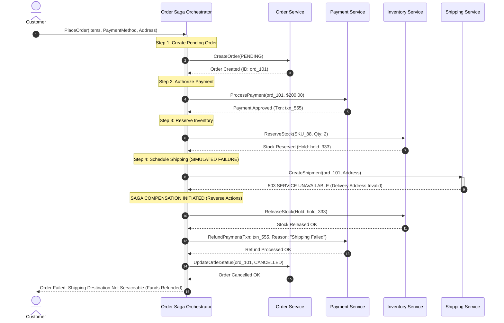

# Distributed Transaction Saga: Orchestration with Compensating Rollback

Demonstrates how an **Orchestrator-driven Saga** handles failures by executing compensating transactions to restore system consistency.

