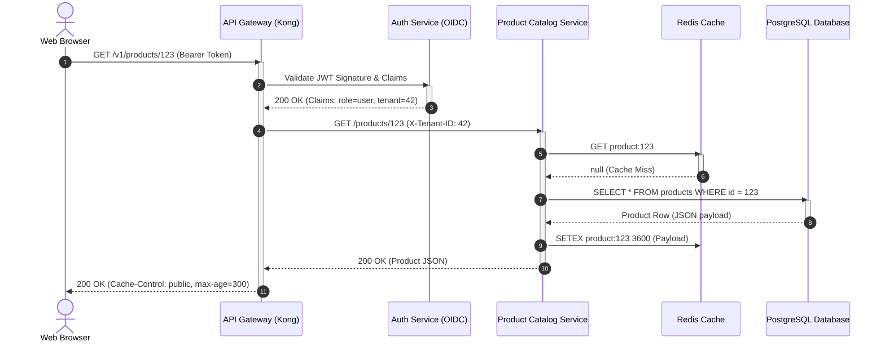

# Synchronous Request-Reply Sequence Diagram

Synchronous interactions block the calling client until the receiving server processes the request and returns a response.

## Architectural Considerations
- **Blocking Latency**: End-to-end latency is the sum of all serial calls.
- **Cascading Exhaustion**: Thread starvation in upstream callers if downstream databases lock.
