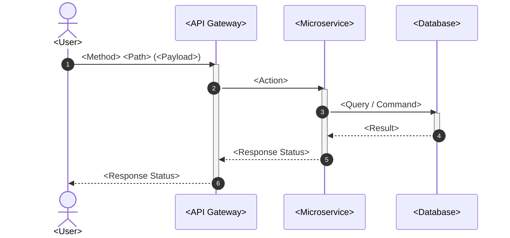

# Sequence Diagram Starter Templates

## 1. Minimal Request-Reply Template

```mermaid
sequenceDiagram
    autonumber
    actor User as <User>
    participant Gateway as <API Gateway>
    participant Service as <Microservice>
    participant Database as <Database>

    User->>Gateway: <Method> <Path> (<Payload>)
    activate Gateway
    Gateway->>Service: <Action>
    activate Service
    Service->>Database: <Query / Command>
    activate Database
    Database-->>Service: <Result>
    deactivate Database
    Service-->>Gateway: <Response Status>
    deactivate Service
    Gateway-->>User: <Response Status>
    deactivate Gateway
```
