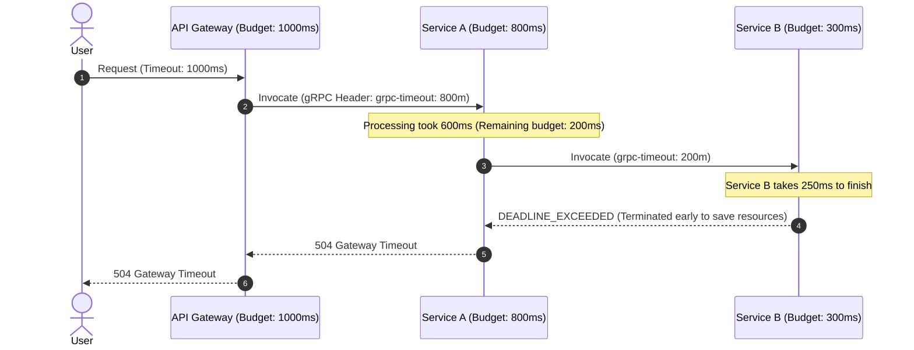

# Distributed Deadline Propagation & Timeout Budget

```mermaid
sequenceDiagram
    autonumber
    actor Client as User
    participant Gateway as API Gateway (Budget: 1000ms)
    participant ServiceA as Service A (Budget: 800ms)
    participant ServiceB as Service B (Budget: 300ms)

    Client->>Gateway: Request (Timeout: 1000ms)
    Gateway->>ServiceA: Invocate (gRPC Header: grpc-timeout: 800m)
    Note over ServiceA: Processing took 600ms (Remaining budget: 200ms)
    ServiceA->>ServiceB: Invocate (grpc-timeout: 200m)
    Note over ServiceB: Service B takes 250ms to finish
    ServiceB-->>ServiceA: DEADLINE_EXCEEDED (Terminated early to save resources)
    ServiceA-->>Gateway: 504 Gateway Timeout
    Gateway-->>Client: 504 Gateway Timeout
```
