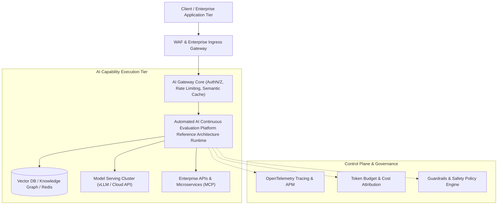

# Automated AI Continuous Evaluation Platform Reference Architecture

## 1. Business Problem & Enterprise Context
Automated CI/CD testing platform running golden test suites, LLM-as-a-Judge evaluations, and RAG Triad regression gates before production deployments. Global enterprises require an architectural blueprint that balances innovation with deterministic operational stability, rigorous access control, and defensible unit economics.

---

## 2. Requirements & Non-Functional Requirements (NFRs)
* **Functional Requirements**: Provide seamless natural language capabilities, integrate with enterprise systems of record, and maintain persistent conversation state.
* **Latency SLA**: P99 Time-to-First-Token (TTFT) $< 800	ext{ms}$; Time-per-Output-Token (TPOT) $> 30	ext{ tokens/sec}$.
* **Availability SLA**: 99.95% uptime across multi-region / multi-provider configurations.
* **Security & Compliance**: Zero plaintext credential storage; strict tenant data isolation; EU AI Act and GDPR Article 17 compliance.

---

## 3. System Topology & Architecture

---

## 4. Key Components & Implementation Contracts
* **AI Gateway Router**: Intercepts requests, validates JWT claims, checks token quotas, and checks semantic cache.
* **Execution Runtime**: Coordinates data retrieval, prompt synthesis, model invocation, and tool execution.
* **Security Guardrail Engine**: Enforces input/output filtering, PII masking, and JSON Schema grammar conformance.

---

## 5. Data Flow & Execution Sequence
1. Inbound request is authenticated at the gateway boundary.
2. Inbound guardrails inspect the prompt for injection attacks and anonymize PII.
3. Relevant enterprise context is retrieved from vector and relational datastores.
4. Model inference is executed via streaming SSE protocols.
5. Outbound guardrails assert schema validity and scan for canary token leakage.
6. The validated stream is delivered to the client while telemetry spans are emitted asynchronously.

---

## 6. Security, Governance & Compliance Controls
* **Tenant Isolation**: Mandatory `tenant_id` filtering injected at the gateway middleware layer.
* **Canary Egress Sniffers**: Active detection of system prompt extraction attempts.
* **Audit Trails**: All model inputs, outputs, and tool mutations are logged to WORM compliance storage.

---

## 7. Reliability, Failure Modes & Circuit Breakers
* **Multi-Provider Failover**: Upstream 429/503 errors trigger automatic fallback to secondary cloud providers within 150ms.
* **Idempotency**: All state-mutating tool calls require deterministic transaction keys.

---

## 8. Cost Economics & Infrastructure Sizing
* **Token Unit Economics**: Optimized via semantic caching, prompt compression, and model routing cascades.
* **ROI Target**: Total AI processing cost must remain below 5% of the economic value delivered by the business task.

---

## 9. Architectural Evolution & Modernization Path
As model capabilities advance, the decoupled gateway abstraction allows replacing underlying model checkpoints without modifying client application code or breaking downstream contracts.
