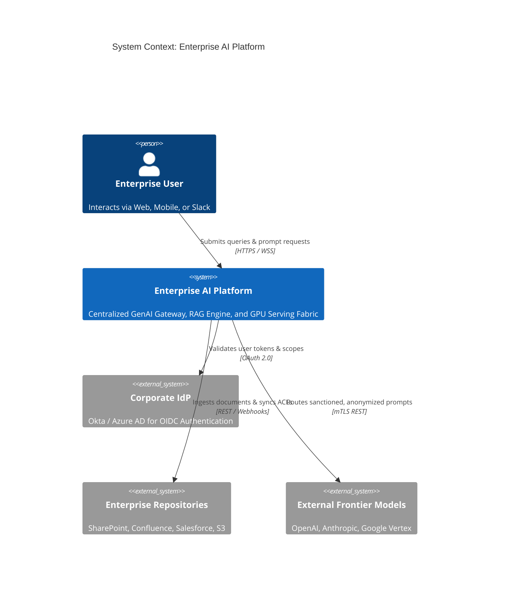
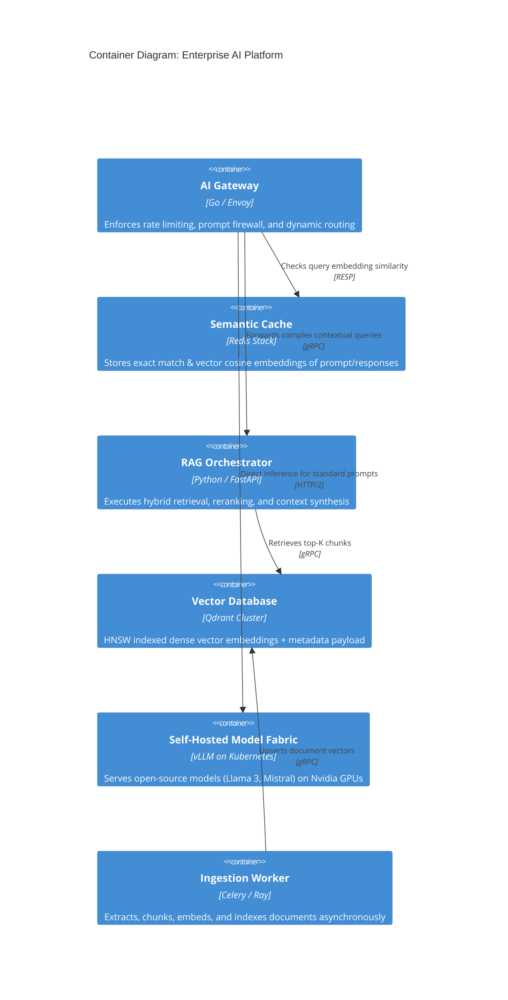

# C4 Architecture Model & Cloud Mapping: Enterprise AI Platform

## 1. C4 Level 1: System Context Diagram

---

## 2. C4 Level 2: Container Diagram

---

## 3. Technology-Neutral to Cloud Provider Mapping

| Component | Technology-Neutral | AWS Implementation | Azure Implementation | GCP Implementation |
| :--- | :--- | :--- | :--- | :--- |
| **AI Gateway** | Envoy / Kong / LiteLLM | Amazon ECS / EKS | Azure Container Apps | Cloud Run / GKE |
| **GPU Inference** | vLLM / TensorRT-LLM | EKS (G5 / P4de Instances) | AKS (NCv3 / NDv4 Instances) | GKE (G2 / A3 Instances) |
| **Vector Database**| Qdrant / Milvus | Amazon OpenSearch / Qdrant Cloud| Azure AI Search / Qdrant | Vertex AI Vector Search |
| **Document Storage**| Object Storage | Amazon S3 | Azure Blob Storage | Google Cloud Storage |
| **Message Queue** | Apache Kafka | Amazon MSK | Azure Event Hubs | Google Cloud Pub/Sub |
| **Cache & KV** | Redis Cluster | Amazon ElastiCache | Azure Cache for Redis | Cloud Memorystore |
