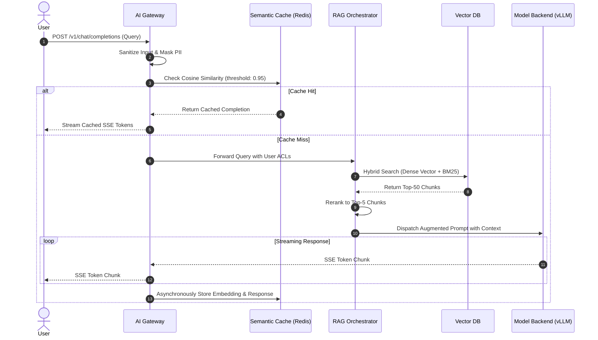

# Sequence Flows & Failure Recovery: Enterprise AI Platform

## 1. End-to-End RAG Query Execution Sequence

---

## 2. Failure Recovery Flow: Frontier Model Rate Limit (HTTP 429)
When external API returns HTTP 429:
1. Circuit breaker trips immediately.
2. Request is automatically downgraded and routed to self-hosted vLLM fallback pool within 150ms.
3. User receives complete response without disruption.
