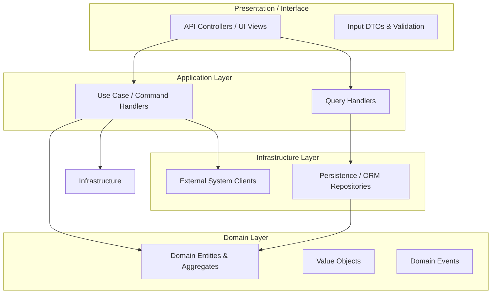

# Reference Architecture: Angular Enterprise Architecture (Nx Monorepo)

## 1. Architectural Vision & Enterprise Context
Enterprise workspace architecture organized into feature, ui, data-access, and util libraries using standalone components, Signals, and NgRx state management.

---

## 2. Component & Boundary Blueprint

---

## 3. Core Architectural Invariants
- Dependencies point inward toward the Domain Core.
- Framework dependencies are prohibited from polluting core business models.
- Verification rules and automated fitness functions enforce module boundaries on every commit.
