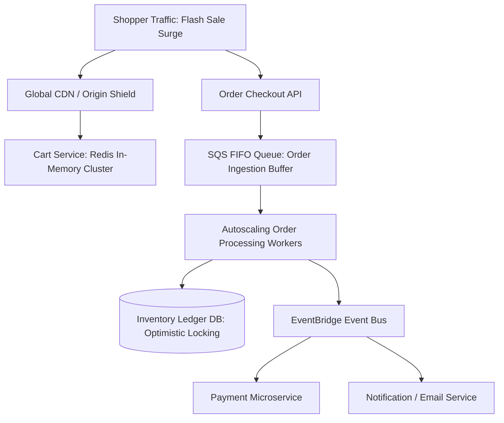

# Cloud Reference Architecture: High-Throughput E-Commerce Platform

## 1. Executive Summary
An elastic retail platform engineered to withstand 10x traffic surges during Black Friday flash sales using event-driven decoupling and optimistic inventory reservation.

---

## 2. End-to-End Architecture Topology

---

## 3. Core Architectural Components & Flow
1. **Traffic Absorption**: High-speed shopping cart state is maintained entirely in Redis, shielding databases from browsing traffic.
2. **Checkout Buffer**: Checkout requests are written immediately to an SQS FIFO queue with a 200 OK acknowledgment, decoupling customer click latency from backend transaction processing.
3. **Inventory Reservation**: Workers dequeue orders and apply atomic optimistic locking against Aurora PostgreSQL, avoiding pessimistic table locks.

---

## 4. Security & Zero Trust Controls
- PCI-DSS compliant payment processing isolated in a dedicated VPC enclave.
- Tokenization service isolates credit card numbers before order persistence.

---

## 5. High Availability & Disaster Recovery
- Auto-scaling scales order processing worker pods from 10 to 300 instances in sub-60 seconds during sales surges.
- Read-heavy catalog queries served 99% from edge CDN caches.

---

## 6. FinOps & Cost Architecture
- Baseline worker capacity provisioned with 1-Year Savings Plans; flash surge capacity powered by EC2 Spot instances.
