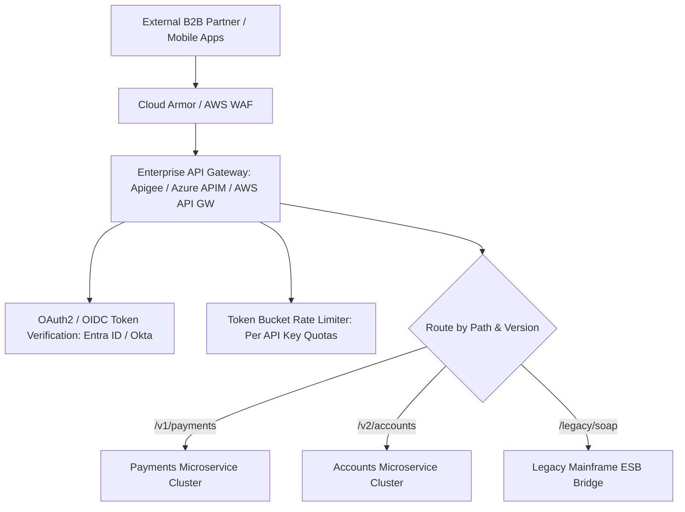

# Cloud Reference Architecture: Enterprise API Management Platform

## 1. Executive Summary
A unified API platform providing centralized authentication, token-bucket throttling, API versioning, and developer portal governance across multi-cloud backend services.

---

## 2. End-to-End Architecture Topology

---

## 3. Core Architectural Components & Flow
1. **Unified Gateway**: Central entry point terminating client connections, enforcing TLS 1.3, and standardizing error responses (RFC 7807).
2. **Security & Rate Limiting**: Validates OAuth2 JWT signatures at the edge; enforces tier-based rate limiting (e.g., Bronze: 100 req/min, Platinum: 10,000 req/min).
3. **Protocol Mediation**: Transforms external modern REST/JSON calls into internal legacy SOAP/XML formats for mainframe backends.

---

## 4. Security & Zero Trust Controls
- Mutual TLS client certificate validation for high-security partner APIs.
- Dynamic payload inspection blocking SQLi, XSS, and excessive request sizes.

---

## 5. High Availability & Disaster Recovery
- Multi-region API Gateway deployment with Anycast routing.
- Backend services protected from traffic spikes via circuit breakers and connection throttling.

---

## 6. FinOps & Cost Architecture
- API monetization metering tracking billable requests per partner; caching GET responses at edge reduces backend compute costs by 60%.
