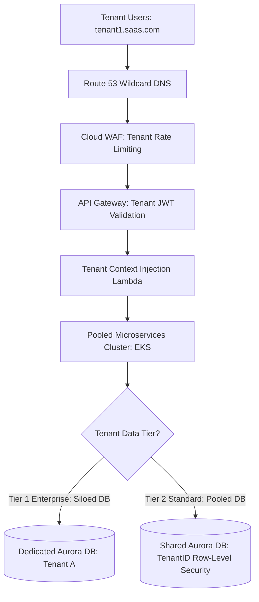

# Cloud Reference Architecture: Enterprise Multi-Tenant SaaS Platform

## 1. Executive Summary
A scalable multi-tenant SaaS architecture supporting pooled and siloed compute models, dynamic tenant database routing, tenant-isolated encryption, and granular tenant cost attribution.

---

## 2. End-to-End Architecture Topology

---

## 3. Core Architectural Components & Flow
1. **Tenant Identification**: Ingress requests map tenant subdomains (`tenant1.app.com`) to unique Tenant IDs via JWT claims validated at API Gateway.
2. **Compute Tier**: Pooled multi-tenant microservices on EKS with Pod Security Standards isolating runtime namespaces.
3. **Hybrid Data Isolation**: Tier-1 enterprise clients receive dedicated database instances (siloed model); standard SMB clients share a multi-tenant database using PostgreSQL Row-Level Security (RLS).

---

## 4. Security & Zero Trust Controls
- Every tenant receives a unique KMS Customer Managed Key (CMK) for data encryption at rest.
- IAM policies enforce dynamic ABAC boundaries (`aws:PrincipalTag/TenantId == aws:ResourceTag/TenantId`).

---

## 5. High Availability & Disaster Recovery
- Multi-AZ deployment across 3 AZs.
- Automated tenant-by-tenant backup and restore capabilities for regulatory compliance.

---

## 6. FinOps & Cost Architecture
- **FinOps Unit Economics**: Emits tenant ID metadata with every API call and database query, calculating exact monthly infrastructure spend per tenant to calculate gross margins.
