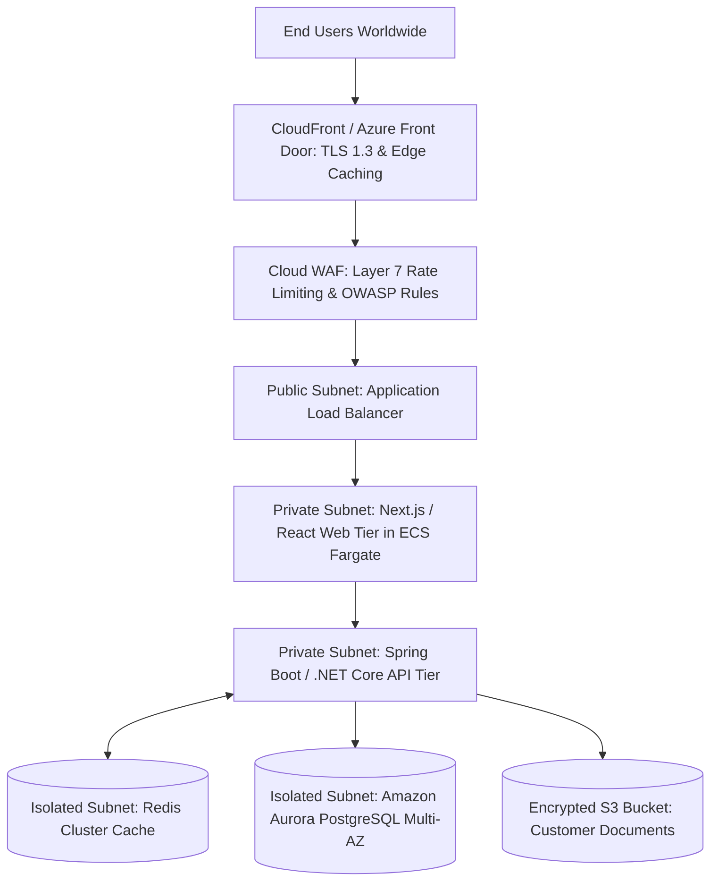

# Cloud Reference Architecture: Enterprise Web Application

## 1. Executive Summary
A resilient, highly available multi-tier web application architecture featuring edge caching, WAF inspection, stateless container compute, in-memory caching, and managed relational persistence across 3 Availability Zones.

---

## 2. End-to-End Architecture Topology

---

## 3. Core Architectural Components & Flow
1. **Edge Tier**: CDN terminates client TLS handshakes and caches static assets (JS/CSS/images) with 1-year immutable TTLs. Cloud WAF blocks malicious bots and SQLi.
2. **Ingress Tier**: Multi-AZ Application Load Balancer terminates public traffic and forwards requests to private application subnets.
3. **Compute Tier**: Stateless container tasks running on AWS Fargate / Azure Container Apps, autoscaling based on HTTP request depth.
4. **Data Tier**: Aurora PostgreSQL cluster across 3 AZs. Read queries routed to read replicas; write transactions sent to the primary writer. Redis caches active sessions and hot product metadata.

---

## 4. Security & Zero Trust Controls
- Public access blocked on all subnets except the ALB tier.
- Zero hardcoded credentials; database passwords rotated automatically via Secrets Manager.
- Network communication between web and API tiers governed by Security Group ID references.

---

## 5. High Availability & Disaster Recovery
- **Multi-AZ Availability**: 99.99% intra-region uptime SLA. If AZ1 fails, ALB reroutes traffic to AZ2/AZ3 in seconds.
- **Disaster Recovery**: Cross-region Aurora Global Database snapshot replication to secondary region (RTO: 30 mins, RPO: < 1 min).

---

## 6. FinOps & Cost Architecture
- 3-Year Compute Savings Plans cover 80% of steady-state Fargate tasks.
- S3 Intelligent-Tiering automatically moves documents older than 30 days to cold storage.
