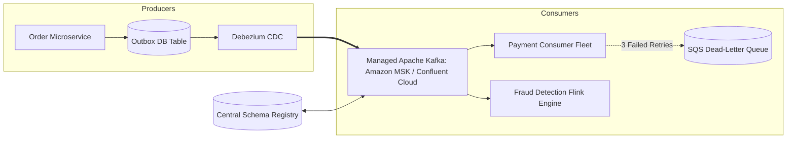

# Cloud Reference Architecture: Enterprise Event-Driven Streaming Platform

## 1. Executive Summary
A high-throughput event streaming backbone powered by Apache Kafka, schema registries, outbox CDC pipelines, and dead-letter queues.

---

## 2. End-to-End Architecture Topology

---

## 3. Core Architectural Components & Flow
1. **Transactional Outbox**: Business mutations and event publishing execute within the same local database transaction, eliminating dual-write inconsistencies.
2. **Schema Governance**: Enforces backward-compatible Avro/Protobuf schemas via a central Schema Registry, preventing producer changes from breaking consumers.
3. **Poison Pill Handling**: Malformed events are routed to a Dead-Letter Queue after 3 failed processing attempts, alerting SREs without blocking stream partitions.

---

## 4. Security & Zero Trust Controls
- Kafka SASL/SCRAM and IAM authentication.
- Message payloads encrypted with KMS envelope encryption before publishing.

---

## 5. High Availability & Disaster Recovery
- Multi-AZ partition distribution (3 AZs, Min In-Sync Replicas: 2).
- Partition count sized to support 50,000 events/sec sustained throughput.

---

## 6. FinOps & Cost Architecture
- Kafka tiered storage automatically moves historical message segments older than 24 hours from expensive EBS volumes to cost-effective S3 storage.
