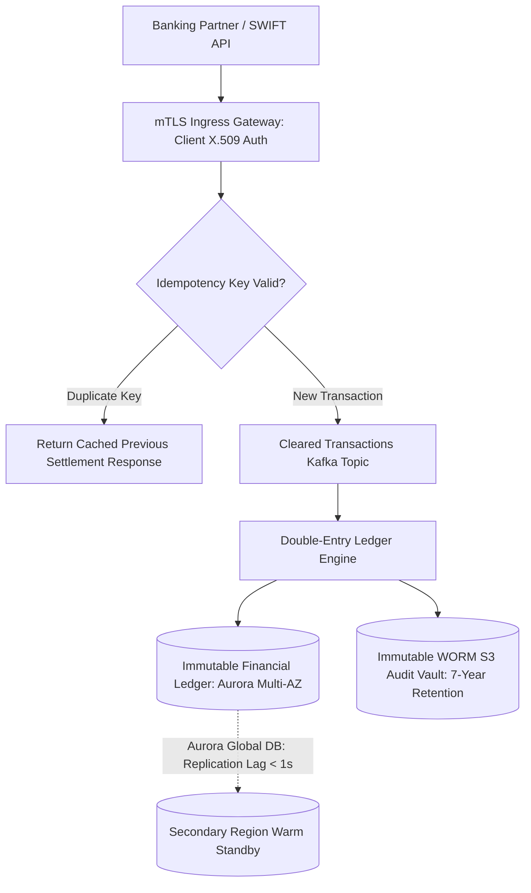

# Cloud Reference Architecture: Financial Transaction & Clearing Platform

## 1. Executive Summary
A mission-critical financial ledger platform enforcing strict idempotency, immutable audit logging, double-entry bookkeeping, and sub-minute disaster recovery failover.

---

## 2. End-to-End Architecture Topology

---

## 3. Core Architectural Components & Flow
1. **Idempotency Guard**: Every financial request carries a unique `Idempotency-Key` validated against DynamoDB before processing, preventing double-debits during network retries.
2. **Double-Entry Accounting**: Ledger entries enforce balanced debits and credits within atomic ACID database transactions.
3. **Audit Immutability**: All settled transactions emit signed audit logs to an S3 bucket configured in Compliance Mode with MFA Delete.

---

## 4. Security & Zero Trust Controls
- Mandatory mutual TLS (mTLS) with client certificate revocation lists (CRL).
- Master encryption keys stored in FIPS 140-2 Level 3 Cloud Hardware Security Modules (HSMs).

---

## 5. High Availability & Disaster Recovery
- **RTO < 5 Minutes, RPO < 1 Second**: Aurora Global Database with automated Route 53 Application Recovery Controller failover to secondary region.

---

## 6. FinOps & Cost Architecture
- Dedicated reserved capacity for ledger instances; automated cold-storage archiving of settled historical ledgers.
