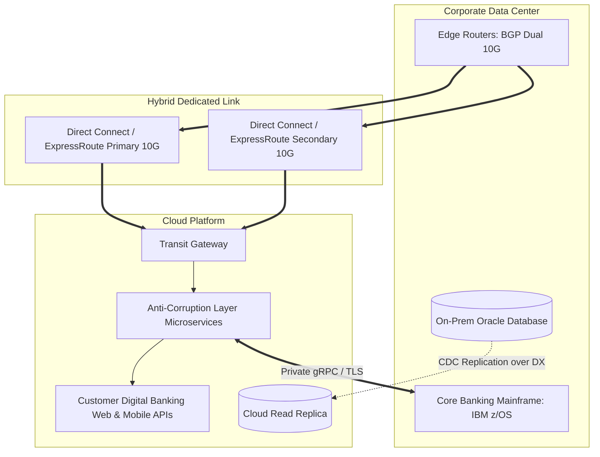

# Cloud Reference Architecture: Hybrid Enterprise Datacenter Platform

## 1. Executive Summary
An enterprise integration platform connecting on-premises core banking mainframes with cloud-native customer-facing microservices over redundant dedicated fiber.

---

## 2. End-to-End Architecture Topology

---

## 3. Core Architectural Components & Flow
1. **Dedicated Fiber Transport**: Dual 10 Gbps Direct Connect circuits terminate in diverse carrier exchanges, providing sub-5ms deterministic latency.
2. **Anti-Corruption Layer (ACL)**: Cloud microservices communicate with legacy mainframes via an ACL that translates modern JSON REST payloads into COBOL copybooks.
3. **Mainframe Offloading**: Core transactional data is replicated to cloud databases via CDC, allowing customer balance queries to be served in the cloud without consuming mainframe MIPS.

---

## 4. Security & Zero Trust Controls
- Dedicated IPsec / MACsec encryption over physical Direct Connect circuits.
- Strict Next-Generation Firewall inspection on all traffic entering corporate data centers.

---

## 5. High Availability & Disaster Recovery
- High-availability BGP routing with BFD (Bidirectional Forwarding Detection) initiates circuit failover in sub-500 milliseconds.
- Backup IPsec VPN over public internet.

---

## 6. FinOps & Cost Architecture
- Offloading read queries to cloud read replicas saves hundreds of thousands of dollars in annual mainframe processor licensing fees.
