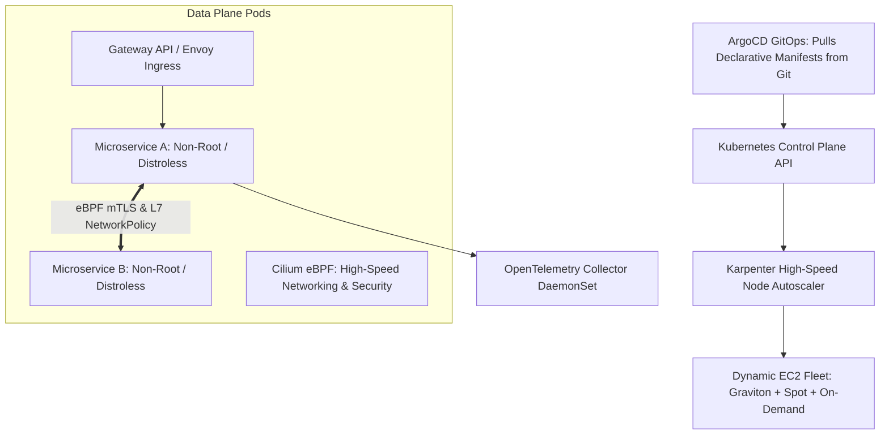

# Cloud Reference Architecture: Enterprise Kubernetes Platform (EKS/AKS/GKE)

## 1. Executive Summary
A multi-tenant, production-hardened Kubernetes platform featuring automated Karpenter node provisioning, Cilium eBPF networking, GitOps delivery, and unified OpenTelemetry.

---

## 2. End-to-End Architecture Topology

---

## 3. Core Architectural Components & Flow
1. **Declarative GitOps Delivery**: All cluster resources, CRDs, and applications are synchronized from Git repositories using ArgoCD, eliminating manual `kubectl` interventions.
2. **High-Speed Node Autoscaling**: Karpenter evaluates pending pods and provisions right-sized Graviton and Spot worker nodes in sub-45 seconds.
3. **eBPF Security & Networking**: Cilium replaces legacy iptables with eBPF kernel bytecode, delivering microsecond packet routing and deep L7 observability.

---

## 4. Security & Zero Trust Controls
- Default-deny NetworkPolicies in all namespaces.
- Pod Security Standards enforced in `restricted` mode.
- Workload identity federation mapping K8s Service Accounts directly to cloud IAM roles.

---

## 5. High Availability & Disaster Recovery
- Multi-AZ node distribution across 3 AZs with Topology Spread Constraints.
- Cluster upgrades executed via automated Blue/Green cluster replacement.

---

## 6. FinOps & Cost Architecture
- Karpenter automated instance consolidation and Graviton ARM64 adoption reduces compute spend by 40% compared to static node groups.
