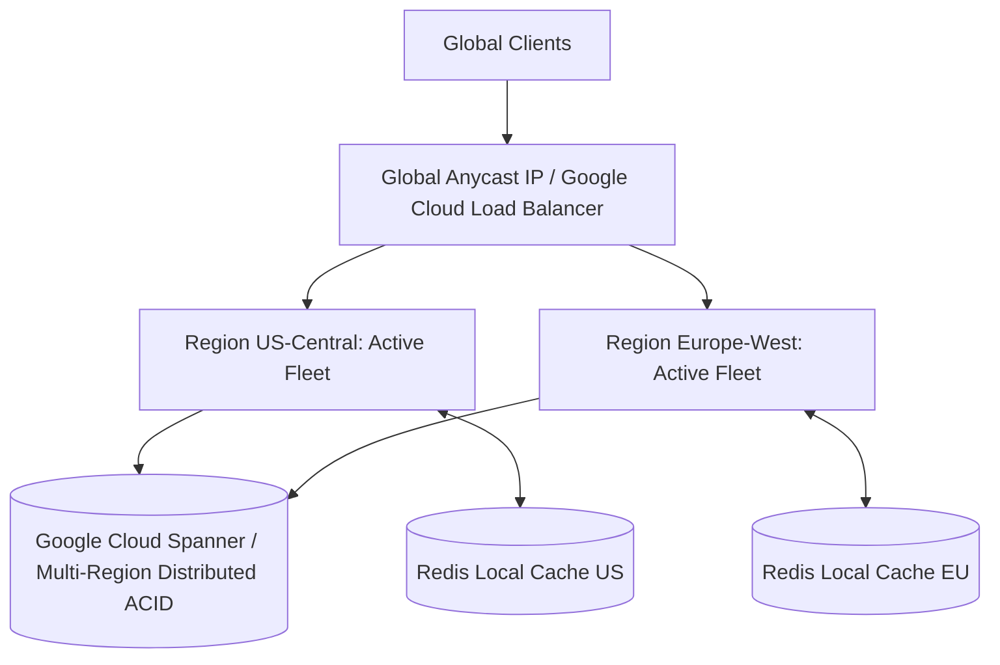

# Cloud Reference Architecture: Multi-Region Planetary Platform

## 1. Executive Summary
A globally distributed platform serving worldwide users with sub-50ms latency and surviving total continental outages using Anycast IP routing and planetary ACID databases.

---

## 2. End-to-End Architecture Topology

---

## 3. Core Architectural Components & Flow
1. **Anycast Routing**: Clients connect to the physically nearest edge PoP, traversing Google/AWS global private fiber networks directly to the closest regional cluster.
2. **Distributed ACID Persistence**: Google Cloud Spanner multi-region instance delivers external consistency (serializability) across continental regions via TrueTime.
3. **Local Cache**: Regional Redis instances cache localized read-heavy data, eliminating cross-region network round-trips for 90% of requests.

---

## 4. Security & Zero Trust Controls
- Independent regional IAM roles and KMS encryption keys.
- Data residency controls enforce storing European citizen data within EU boundaries.

---

## 5. High Availability & Disaster Recovery
- Near-zero RTO: If an entire cloud region suffers catastrophic destruction, the Global Load Balancer redirects traffic in sub-seconds.
- 99.999% availability SLA.

---

## 6. FinOps & Cost Architecture
- Significant investment; reserved multi-region Spanner compute nodes and cross-continental network egress charges must be continuously monitored.
