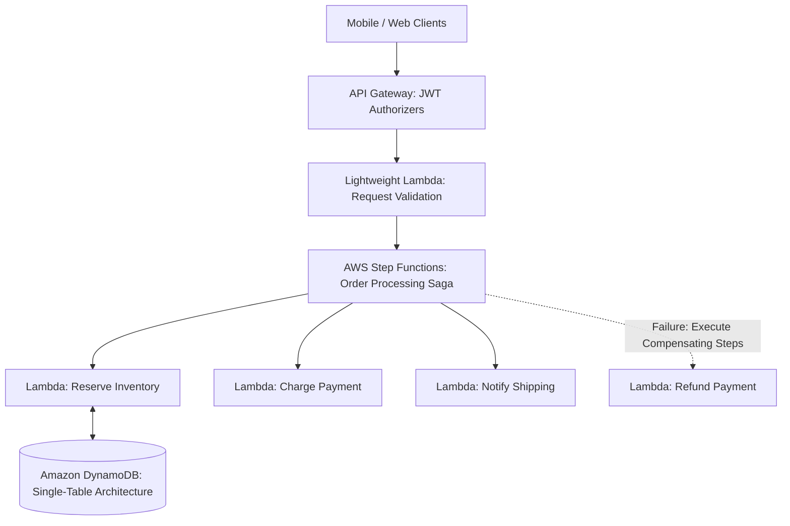

# Cloud Reference Architecture: Enterprise Serverless Platform

## 1. Executive Summary
A fully managed, event-driven serverless platform combining API Gateway, Function-as-a-Service, serverless NoSQL, and Step Functions workflow orchestration.

---

## 2. End-to-End Architecture Topology

---

## 3. Core Architectural Components & Flow
1. **Serverless Entry**: API Gateway validates JWT tokens at the edge and invokes lightweight stateless Lambda functions.
2. **Saga Workflow Orchestration**: Complex multi-step business transactions execute within Step Functions state machines with automated error handling and compensating rollbacks.
3. **Persistence**: Amazon DynamoDB single-table design delivers single-digit millisecond read/write latencies at any scale.

---

## 4. Security & Zero Trust Controls
- Dedicated micro-IAM roles per Lambda function with minimal permission scoping.
- Ephemeral container memory purged before process exit.

---

## 5. High Availability & Disaster Recovery
- Scales automatically from zero to thousands of concurrent executions in seconds without server management.
- Provisioned Concurrency pre-warms payment functions.

---

## 6. FinOps & Cost Architecture
- 100% pay-per-use billing; zero cost during zero-traffic hours. DynamoDB on-demand billing eliminates capacity over-provisioning.
