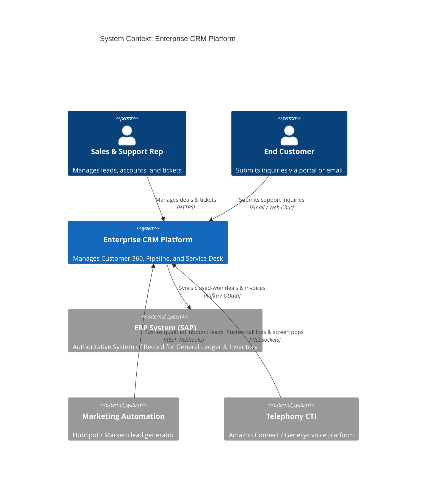
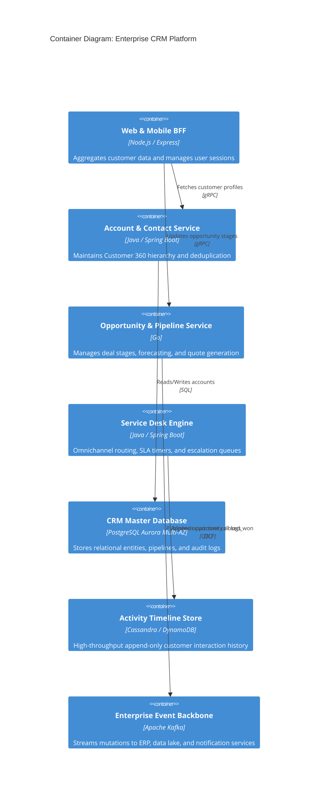

# C4 Architecture Model & Cloud Mapping: Enterprise CRM

## 1. C4 Level 1: System Context Diagram

---

## 2. C4 Level 2: Container Diagram

---

## 3. Technology-Neutral to Cloud Provider Mapping

| Component | Technology-Neutral | AWS Implementation | Azure Implementation | GCP Implementation |
| :--- | :--- | :--- | :--- | :--- |
| **API Gateway** | Kong / Envoy | Amazon API Gateway | Azure API Management | Apigee / Cloud Endpoints |
| **Microservices Compute**| Kubernetes (Containerized)| Amazon EKS | Azure Kubernetes Service (AKS)| Google Kubernetes Engine (GKE) |
| **Relational OLTP** | PostgreSQL | Amazon Aurora PostgreSQL | Azure Database for PostgreSQL | Cloud SQL for PostgreSQL |
| **Activity Store** | Wide-column NoSQL | Amazon DynamoDB | Azure Cosmos DB | Google Cloud Bigtable |
| **Event Streaming** | Apache Kafka | Amazon MSK | Azure Event Hubs | Google Cloud Pub/Sub |
| **Search Engine** | Elasticsearch / OpenSearch | Amazon OpenSearch Service | Azure AI Search | Google Cloud OpenSearch |
