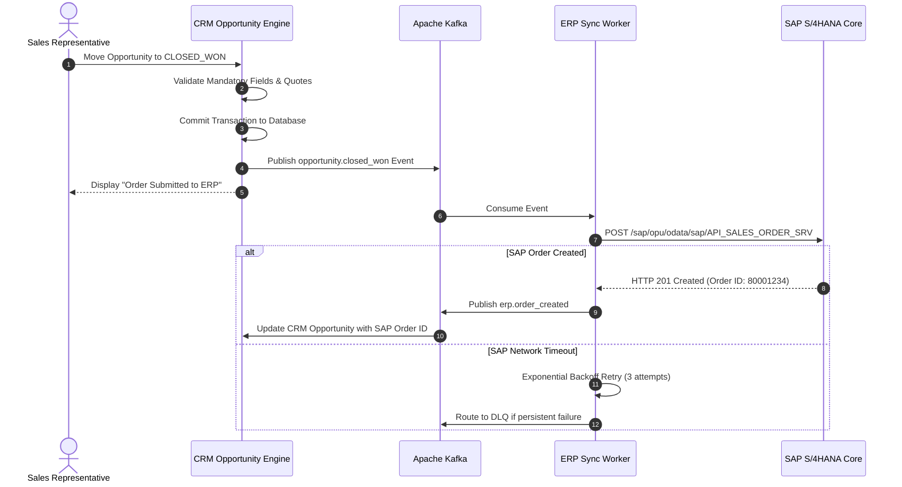

# Sequence Flows & Failure Recovery: Enterprise CRM

## 1. Lead Qualification to ERP Order Synchronization

```mermaid
sequenceDiagram
    autonumber
    actor Rep as Sales Representative
    participant CRM as CRM Opportunity Engine
    participant EventBus as Apache Kafka
    participant ERP_Bridge as ERP Sync Worker
    participant SAP as SAP S/4HANA Core

    Rep->>CRM: Move Opportunity to CLOSED_WON
    CRM->>CRM: Validate Mandatory Fields & Quotes
    CRM->>CRM: Commit Transaction to Database
    CRM->>EventBus: Publish opportunity.closed_won Event
    CRM-->>Rep: Display "Order Submitted to ERP"

    EventBus->>ERP_Bridge: Consume Event
    ERP_Bridge->>SAP: POST /sap/opu/odata/sap/API_SALES_ORDER_SRV
    alt SAP Order Created
        SAP-->>ERP_Bridge: HTTP 201 Created (Order ID: 80001234)
        ERP_Bridge->>EventBus: Publish erp.order_created
        EventBus->>CRM: Update CRM Opportunity with SAP Order ID
    else SAP Network Timeout
        ERP_Bridge->>ERP_Bridge: Exponential Backoff Retry (3 attempts)
        ERP_Bridge->>EventBus: Route to DLQ if persistent failure
    end
```
