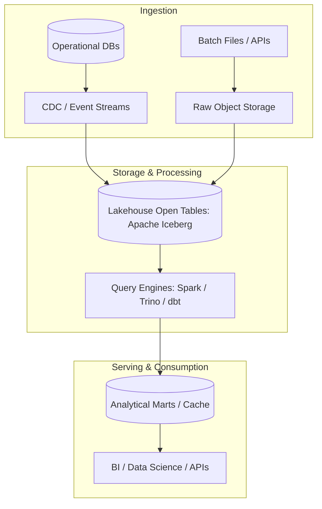

# Reference Architecture: Enterprise Data Lake Reference Architecture

## 1. Architectural Vision & Context
S3/ADLS multi-tier object storage (raw bronze, cleansed silver, aggregated gold), Parquet compression, Glue catalog integration, and lifecycle retention policies.

---

## 2. Architecture Topology Blueprint

---

## 3. Core Architectural Invariants & Governance
- Storage and compute must scale independently.
- Raw data ingestion must be immutable to preserve disaster recomputation capability.
- Automated data contract verification must execute before datasets are promoted to serving layers.
