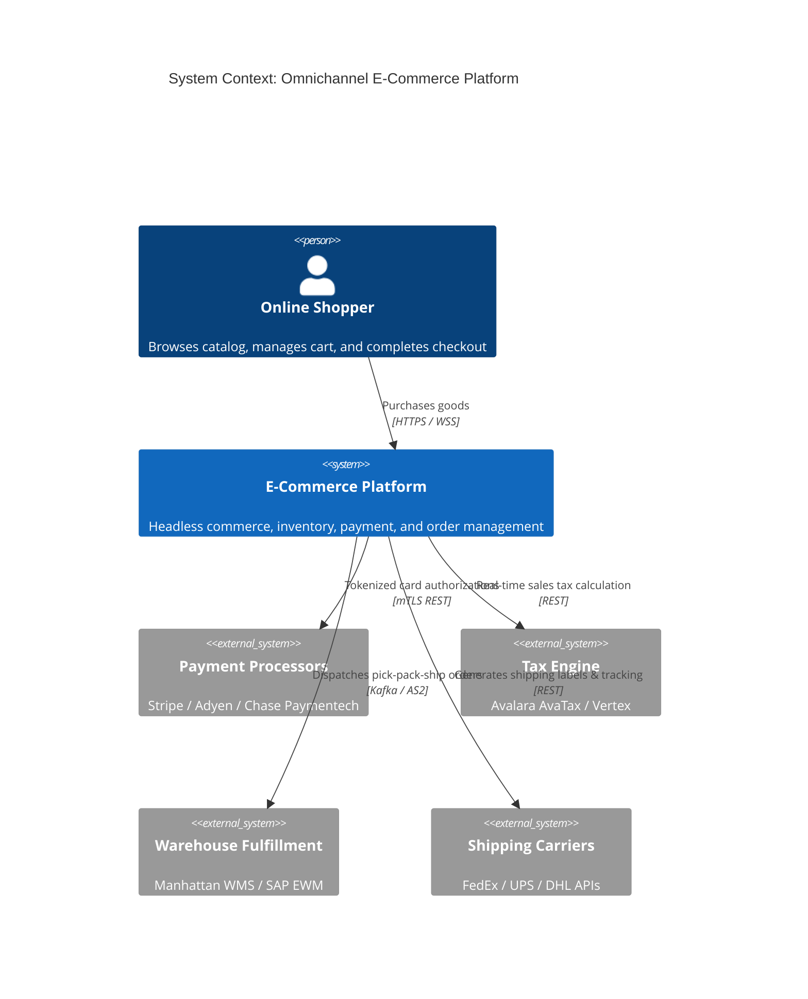
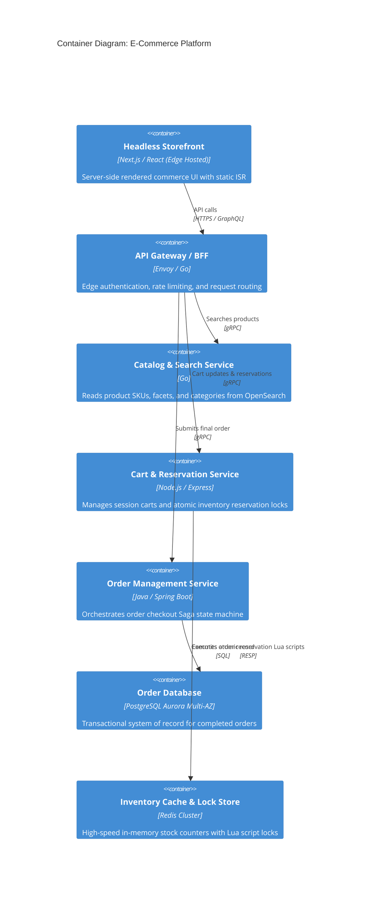

# C4 Architecture Model & Cloud Mapping: E-Commerce Platform

## 1. C4 Level 1: System Context Diagram

```mermaid
C4Context
title System Context: Omnichannel E-Commerce Platform
Person(shopper, "Online Shopper", "Browses catalog, manages cart, and completes checkout")
System(ecom, "E-Commerce Platform", "Headless commerce, inventory, payment, and order management")
System_Ext(payment_gateway, "Payment Processors", "Stripe / Adyen / Chase Paymentech")
System_Ext(tax_service, "Tax Engine", "Avalara AvaTax / Vertex")
System_Ext(wms, "Warehouse Fulfillment", "Manhattan WMS / SAP EWM")
System_Ext(carrier, "Shipping Carriers", "FedEx / UPS / DHL APIs")

Rel(shopper, ecom, "Purchases goods", "HTTPS / WSS")
Rel(ecom, payment_gateway, "Tokenized card authorizations", "mTLS REST")
Rel(ecom, tax_service, "Real-time sales tax calculation", "REST")
Rel(ecom, wms, "Dispatches pick-pack-ship orders", "Kafka / AS2")
Rel(ecom, carrier, "Generates shipping labels & tracking", "REST")
```

---

## 2. C4 Level 2: Container Diagram

```mermaid
C4Container
title Container Diagram: E-Commerce Platform
Container(storefront, "Headless Storefront", "Next.js / React (Edge Hosted)", "Server-side rendered commerce UI with static ISR")
Container(gateway, "API Gateway / BFF", "Envoy / Go", "Edge authentication, rate limiting, and request routing")
Container(catalog_svc, "Catalog & Search Service", "Go", "Reads product SKUs, facets, and categories from OpenSearch")
Container(cart_svc, "Cart & Reservation Service", "Node.js / Express", "Manages session carts and atomic inventory reservation locks")
Container(order_svc, "Order Management Service", "Java / Spring Boot", "Orchestrates order checkout Saga state machine")
Container(db_orders, "Order Database", "PostgreSQL Aurora Multi-AZ", "Transactional system of record for completed orders")
Container(redis_inv, "Inventory Cache & Lock Store", "Redis Cluster", "High-speed in-memory stock counters with Lua script locks")

Rel(storefront, gateway, "API calls", "HTTPS / GraphQL")
Rel(gateway, catalog_svc, "Searches products", "gRPC")
Rel(gateway, cart_svc, "Cart updates & reservations", "gRPC")
Rel(cart_svc, redis_inv, "Executes atomic reservation Lua scripts", "RESP")
Rel(gateway, order_svc, "Submits final order", "gRPC")
Rel(order_svc, db_orders, "Commits order record", "SQL")
```
