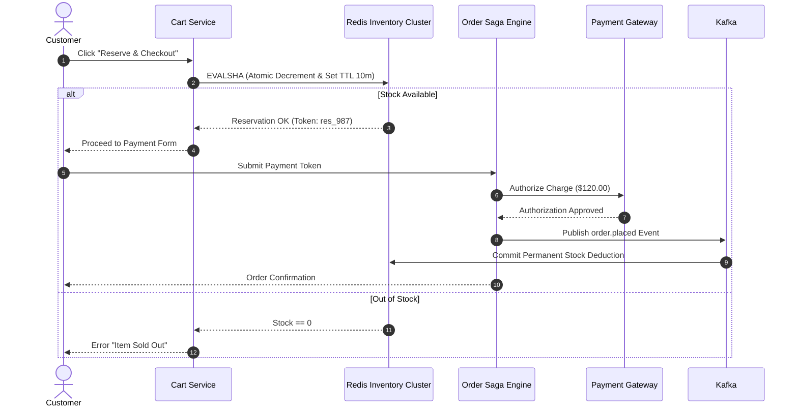

# Sequence Flows & Failure Recovery: E-Commerce Platform

## 1. Flash-Sale Checkout Sequence with Redis Reservation

```mermaid
sequenceDiagram
    autonumber
    actor Customer
    participant Cart as Cart Service
    participant Redis as Redis Inventory Cluster
    participant Order as Order Saga Engine
    participant Pay as Payment Gateway
    participant EventBus as Kafka

    Customer->>Cart: Click "Reserve & Checkout"
    Cart->>Redis: EVALSHA (Atomic Decrement & Set TTL 10m)
    alt Stock Available
        Redis-->>Cart: Reservation OK (Token: res_987)
        Cart-->>Customer: Proceed to Payment Form
        Customer->>Order: Submit Payment Token
        Order->>Pay: Authorize Charge ($120.00)
        Pay-->>Order: Authorization Approved
        Order->>EventBus: Publish order.placed Event
        EventBus->>Redis: Commit Permanent Stock Deduction
        Order-->>Customer: Order Confirmation #ORD-1001
    else Out of Stock
        Redis-->>Cart: Stock == 0
        Cart-->>Customer: Error "Item Sold Out"
    end
```
