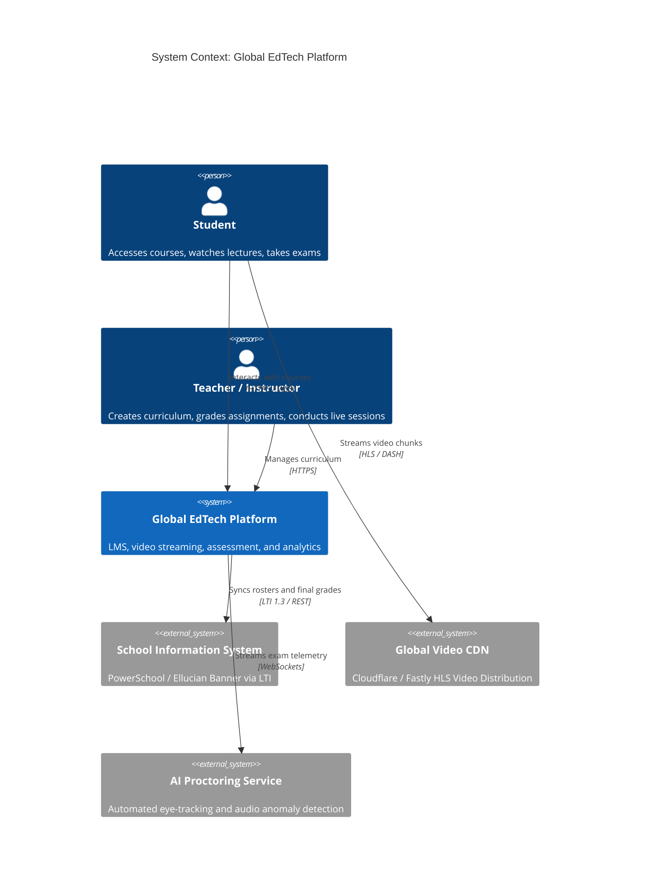

# C4 Architecture Model & Cloud Mapping: Global EdTech Platform

## 1. C4 Level 1: System Context Diagram

---

## 2. Technology-Neutral to Cloud Provider Mapping

| Component | Technology-Neutral | AWS Implementation | Azure Implementation | GCP Implementation |
| :--- | :--- | :--- | :--- | :--- |
| **Video Transcoding** | FFmpeg on Spot Workers | AWS Elemental MediaConvert | Azure Media Services | GCP Transcoder API |
| **Video Distribution**| HLS / DASH over CDN | Amazon CloudFront | Azure Front Door / CDN | Google Cloud CDN |
| **LMS Relational DB** | PostgreSQL | Amazon Aurora PostgreSQL | Azure Database for PostgreSQL | Cloud SQL for PostgreSQL |
| **Telemetry Store** | Wide-column / Time-series| Amazon Timestream / DynamoDB| Azure Cosmos DB | Google Cloud Bigtable |
| **Live Classroom** | WebRTC SFU (LiveKit) | EKS with UDP Load Balancers | AKS with UDP Load Balancers | GKE with UDP Load Balancers |
